# DATABASE ENTITY RELATIONSHIP DIAGRAM (DATABASE_ERD.md)

> **Application:** GouNow El Gouna Lifestyle & Vacation Platform (Laravel 12)  
> **Type:** High-Fidelity Entity Relationship Specification & Visual Model  
> **Notation:** Mermaid ERD (Crow's Foot Notation)  

---

## 1. Visual Entity Relationship Model

```mermaid
erDiagram

    %% -------------------------------------------------------------
    %% AUTH & RBAC DOMAIN
    %% -------------------------------------------------------------
    users ||--o{ role_user : "assigned"
    roles ||--o{ role_user : "grouped in"
    permissions ||--o{ permission_role : "granted to"
    roles ||--o{ permission_role : "contains"
    users ||--o{ permission_user : "granted directly"
    permissions ||--o{ permission_user : "assigned to"
    users ||--o{ personal_access_tokens : "issues"

    %% -------------------------------------------------------------
    %% CUSTOMERS & CRM
    %% -------------------------------------------------------------
    users |o--o| customers : "links account"
    customers ||--o{ bookings : "places"
    customers ||--o{ event_orders : "purchases"
    customers ||--o{ leads : "submits"
    customers ||--o{ discount_usages : "redeems"
    users ||--o{ favorites : "saves"

    %% -------------------------------------------------------------
    %% PROPERTIES & PRICING
    %% -------------------------------------------------------------
    locations ||--o{ properties : "situates"
    property_categories ||--o{ properties : "classifies"
    properties ||--o{ amenity_property : "features"
    amenities ||--o{ amenity_property : "provided by"
    properties ||--o{ seasonal_prices : "overrides pricing"
    properties ||--o{ availability_blocks : "blackouts"
    properties ||--o{ payment_method_property : "accepts"
    payment_methods ||--o{ payment_method_property : "enabled on"

    %% -------------------------------------------------------------
    %% BOOKINGS & TRANSACTIONS
    %% -------------------------------------------------------------
    properties ||--o{ bookings : "reserved as bookable"
    payment_methods ||--o{ bookings : "selected method"
    discounts ||--o{ bookings : "applied promo"
    users |o--o{ bookings : "assigned concierge"
    bookings ||--o{ booking_nightly_prices : "rate audit"
    seasonal_prices |o--o{ booking_nightly_prices : "rate source"
    bookings ||--o{ payment_transactions : "financial settlements"
    customers ||--o{ payment_transactions : "billed to"
    payment_methods ||--o{ payment_transactions : "routed through"
    bookings ||--o{ discount_usages : "redeems promo"
    discounts ||--o{ discount_usages : "tracked in"

    %% -------------------------------------------------------------
    %% EXPERIENCES & EVENTS
    %% -------------------------------------------------------------
    locations ||--o{ experiences : "hosts"
    experience_categories ||--o{ experiences : "categorizes"
    experiences ||--o{ bookings : "booked as bookable"
    
    locations ||--o{ events : "held at"
    events ||--o{ event_ticket_types : "pricing tiers"
    events ||--o{ event_orders : "ordered for"
    events ||--o{ event_tickets : "issued for"
    event_orders ||--o{ event_tickets : "contains"
    event_ticket_types ||--o{ event_tickets : "tier type"
    event_tickets ||--o{ ticket_scans : "scanned at gate"
    users ||--o{ ticket_scans : "scanned by staff"

    %% -------------------------------------------------------------
    %% CMS, MEDIA & OPERATIONS
    %% -------------------------------------------------------------
    users ||--o{ blog_posts : "authors"
    users ||--o{ activity_logs : "triggers"
    users ||--o{ notifications : "receives"
    navigation_items |o--o{ navigation_items : "parent of"

    %% -------------------------------------------------------------
    %% ENTITY ATTRIBUTE DEFINITIONS
    %% -------------------------------------------------------------

    users {
        bigint id PK
        string name
        string email UK
        string password
        string role
        boolean is_admin
        boolean is_active
        boolean two_factor_enabled
        datetime created_at
    }

    roles {
        bigint id PK
        string name UK
        string label
        string description
    }

    permissions {
        bigint id PK
        string name UK
        string label
        string module
    }

    customers {
        bigint id PK
        bigint user_id FK "nullable"
        string first_name
        string last_name
        string email UK
        string phone
        string country_code
        datetime created_at
    }

    locations {
        bigint id PK
        string name_en
        string name_ar
        string slug UK
        decimal latitude
        decimal longitude
    }

    properties {
        bigint id PK
        string title_en
        string slug UK
        string reference_number UK
        bigint property_category_id FK
        bigint location_id FK
        string listing_type
        bigint base_price_cents
        bigint sale_price_cents
        smallint bedrooms
        smallint bathrooms
        smallint max_guests
        string status
        boolean is_published
    }

    seasonal_prices {
        bigint id PK
        bigint property_id FK
        date start_date
        date end_date
        bigint nightly_price_cents
        smallint min_stay_nights
        smallint priority
        boolean is_active
    }

    bookings {
        bigint id PK
        string reference UK
        bigint customer_id FK
        string bookable_type
        bigint bookable_id
        date check_in
        date check_out
        integer nights
        integer guests
        bigint subtotal_cents
        bigint cleaning_fee_cents
        bigint service_fee_cents
        bigint tax_cents
        bigint discount_cents
        bigint total_cents
        bigint deposit_cents
        bigint amount_paid_cents
        bigint amount_remaining_cents
        string currency
        string status
        string payment_status
        datetime expires_at
        string booking_access_token
        string idempotency_key
    }

    booking_nightly_prices {
        bigint id PK
        bigint booking_id FK
        date night_date
        bigint price_cents
        bigint seasonal_price_id FK "nullable"
    }

    payment_transactions {
        bigint id PK
        string transaction_id UK
        string idempotency_key UK
        bigint booking_id FK
        bigint customer_id FK
        bigint payment_method_id FK
        bigint amount_cents
        string currency
        string type
        string status
        string gateway_reference
        string webhook_event_id UK
    }

    events {
        bigint id PK
        string title_en
        string slug UK
        bigint location_id FK
        datetime start_datetime
        datetime end_datetime
        string status
    }

    event_ticket_types {
        bigint id PK
        bigint event_id FK
        string name_en
        bigint price_cents
        integer quantity_available
        integer quantity_sold
    }

    event_orders {
        bigint id PK
        string order_number UK
        bigint event_id FK
        bigint customer_id FK
        bigint total_cents
        string status
        string payment_status
    }

    event_tickets {
        bigint id PK
        bigint event_order_id FK
        bigint event_id FK
        bigint event_ticket_type_id FK
        string ticket_number UK
        string qr_token UK
        bigint price_cents
        string status
    }

    ticket_scans {
        bigint id PK
        bigint event_ticket_id FK
        bigint scanned_by FK
        string result
        datetime created_at
    }

    leads {
        bigint id PK
        string name
        string email
        string phone
        string type
        string status
        string leadable_type
        bigint leadable_id
        bigint customer_id FK
        bigint assigned_to FK
    }

    media {
        bigint id PK
        string mediable_type
        bigint mediable_id
        string file_name
        string file_path
        string mime_type
        integer size_bytes
        integer sort_order
        boolean is_featured
    }
```

---

## 2. Relational Cardinality & Cascade Rules Catalog

| Parent Table | Child Table | Relationship Type | Foreign Key Column | On Delete Action | Business Rationale |
| :--- | :--- | :--- | :--- | :--- | :--- |
| `users` | `customers` | 1-to-1 / 1-to-Many | `customers.user_id` | `SET NULL` | Preserves guest traveler records and past booking history even if staff/user login is deleted. |
| `users` | `role_user` | Many-to-Many (Pivot) | `role_user.user_id` | `CASCADE` | Purges junction record when user is deleted. |
| `roles` | `role_user` | Many-to-Many (Pivot) | `role_user.role_id` | `CASCADE` | Purges junction record when role is deleted. |
| `roles` | `permission_role` | Many-to-Many (Pivot) | `permission_role.role_id` | `CASCADE` | Purges privilege mapping when role is deleted. |
| `permissions` | `permission_role` | Many-to-Many (Pivot) | `permission_role.permission_id` | `CASCADE` | Purges junction record when permission is deleted. |
| `properties` | `amenity_property` | Many-to-Many (Pivot) | `amenity_property.property_id` | `CASCADE` | Automatically cleans up amenity associations on property deletion. |
| `properties` | `seasonal_prices` | 1-to-Many | `seasonal_prices.property_id` | `CASCADE` | Pricing overrides belong exclusively to the property. |
| `properties` | `availability_blocks` | 1-to-Many | `availability_blocks.property_id` | `CASCADE` | Blackout ranges belong exclusively to the property. |
| `customers` | `bookings` | 1-to-Many | `bookings.customer_id` | `SET NULL` | **Critical Accounting Rule:** Guest profile deletion must never destroy booking history or revenue audits. |
| `bookings` | `booking_nightly_prices` | 1-to-Many | `booking_nightly_prices.booking_id` | `CASCADE` | Nightly prices are itemized sub-lines of the booking header. |
| `bookings` | `payment_transactions` | 1-to-Many | `payment_transactions.booking_id` | `SET NULL` | **Critical Financial Rule:** Payment transaction ledger entries are immutable and must persist even if a booking record is cancelled or purged. |
| `payment_methods` | `bookings` | 1-to-Many | `bookings.payment_method_id` | `SET NULL` | Deactivating or deleting a payment gateway option does not corrupt past booking records. |
| `discounts` | `bookings` | 1-to-Many | `bookings.discount_id` | `SET NULL` | Retains promo code snapshot in `bookings.promo_code` even if discount entity is retired. |
| `discounts` | `discount_usages` | 1-to-Many | `discount_usages.discount_id` | `CASCADE` | Purges usage counts if discount record is physically expunged. |
| `events` | `event_ticket_types` | 1-to-Many | `event_ticket_types.event_id` | `CASCADE` | Ticket tiers belong exclusively to the event. |
| `events` | `event_orders` | 1-to-Many | `event_orders.event_id` | `CASCADE` | Order headers belong to the event. |
| `event_orders` | `event_tickets` | 1-to-Many | `event_tickets.event_order_id` | `CASCADE` | Individual ticket items belong to the order header. |
| `event_tickets` | `ticket_scans` | 1-to-Many | `ticket_scans.event_ticket_id` | `CASCADE` | Gate scan attempts belong to the individual ticket item. |
| `navigation_items` | `navigation_items` | Self-Referencing 1-to-Many | `navigation_items.parent_id` | `SET NULL` | Promotes child menu items to root if parent category is removed. |

---

## 3. Polymorphic Association Specifications

The database incorporates 6 polymorphic association interfaces:

1. **`bookings.bookable` (`bookable_type`, `bookable_id`):**
   - Targets: `App\Models\Property`, `App\Models\Experience`.
   - Index: Covered composite index `(bookable_type, bookable_id, status, check_in, check_out)`.
2. **`media.mediable` (`mediable_type`, `mediable_id`):**
   - Targets: `App\Models\Property`, `App\Models\Experience`, `App\Models\Event`, `App\Models\BlogPost`.
   - Index: `(mediable_type, mediable_id, sort_order)`.
3. **`leads.leadable` (`leadable_type`, `leadable_id`):**
   - Targets: `App\Models\Property`, `App\Models\Experience`, `App\Models\Vehicle`.
   - Index: `(leadable_type, leadable_id)`.
4. **`favorites.favoriteable` (`favoriteable_type`, `favoriteable_id`):**
   - Targets: `App\Models\Property`, `App\Models\Experience`.
   - Index: `(favoriteable_type, favoriteable_id)`.
5. **`seo_metadata.seoable` (`seoable_type`, `seoable_id`):**
   - Targets: `App\Models\Property`, `App\Models\Experience`, `App\Models\Event`, `App\Models\Page`, `App\Models\BlogPost`.
   - Index: `(seoable_type, seoable_id, locale)`.
6. **`activity_logs.entity` (`entity_type`, `entity_id`):**
   - Targets: Any audit-tracked Eloquent model instance.
   - Index: `(entity_type, entity_id)`.

---
