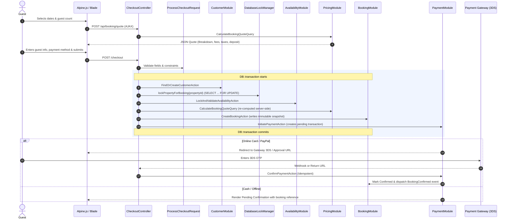

# End-to-End Booking Lifecycle

## 1. Flow Overview
The GouNow booking lifecycle handles high-concurrency reservations with zero tolerance for double bookings, price manipulation, or inconsistent financial records.



---

## 2. Key Stages in Detail

### Stage 1: Dynamic Quote Computation
- **Route:** `POST /api/booking/quote`
- **Controller:** `CheckoutController@calculateQuote`
- **Request:** `CalculateQuoteRequest` validates `property_id`, `check_in`, `check_out`, `guests`, `promo_code`.
- **Query:** `CalculateBookingQuoteQuery` executes:
  1. Validates `DateRange` (check-out must be after check-in, check-in cannot be in the past).
  2. Resolves each night against active `SeasonalPrice` records ordered by `priority DESC`.
  3. Checks `minimum_stay` overrides for the covered period.
  4. Appends cleaning fees and service fees.
  5. Computes promo code percentage or fixed discount (clamped to prevent negative balances).
  6. Calculates deposit requirements (`deposit_type`: `fixed`, `percentage`, `full`).

### Stage 2: Pessimistic Concurrency & Availability Validation
To prevent double bookings when multiple guests attempt to book the exact same villa or yacht at the exact same second:
1. An explicit row-level lock is acquired on the `Property` row:
   ```sql
   SELECT id FROM properties WHERE id = :id FOR UPDATE;
   ```
2. The availability check queries:
   ```sql
   SELECT id FROM bookings
   WHERE bookable_type = 'property'
     AND bookable_id = :id
     AND status IN ('confirmed', 'pending')
     AND check_in < :requestedCheckOut
     AND check_out > :requestedCheckIn
   ```
3. **Turnover Rule:** Because checkout date morning matches check-in date afternoon, intervals where `existing.check_out == requested.check_in` or `existing.check_in == requested.check_out` are strictly non-overlapping and permitted.
4. Active `AvailabilityBlock` records (maintenance, owner stay) are also checked under the lock.
5. If any conflict exists, the transaction rolls back immediately and throws `BookingUnavailableException`.

### Stage 3: Server-Side Financial Snapshotting
Never trust financial figures submitted from the client browser.
The backend re-computes the entire quote during `CreateBookingAction`. Once confirmed:
- `base_price_cents`: Immutable base night cost.
- `total_price_cents`: Final total charged.
- `deposit_paid_cents`: Portion collected at checkout.
- `price_breakdown`: JSON column preserving the complete nightly rate breakdown, seasonal rules applied, and fee itemization at the time of purchase. Even if property prices increase tomorrow, past bookings remain 100% auditable.

### Stage 4: Promotion Code Usage Reservation
If a promotion code is applied:
- The promo row is locked:
  ```sql
  SELECT * FROM promo_codes WHERE code = :code FOR UPDATE;
  ```
- Maximum usage limit (`max_uses`) is checked against current `times_used`.
- `times_used` is incremented atomically.
- A `promo_code_usages` record is inserted with the booking ID.

---

## 3. Failure & Rollback Modes

| Scenario | Behavior |
| :--- | :--- |
| **Simultaneous checkout for same dates** | One guest acquires `FOR UPDATE` lock, verifies availability, and creates booking. The second guest waits for the lock, then detects date overlap, transaction rolls back, and guest receives a localized "Dates no longer available" error. |
| **Payment card declined at 3DS** | Gateway redirects to failure return URL or webhook triggers `FailPaymentAction`. The `payment_transactions` record is marked `failed`. The booking remains `pending` with a time-to-live or is cancelled. |
| **Browser disconnected during payment** | The payment gateway's asynchronous webhook notifies `/payment/webhook`. The server processes `ConfirmPaymentAction` idempotently and confirms the booking. |
