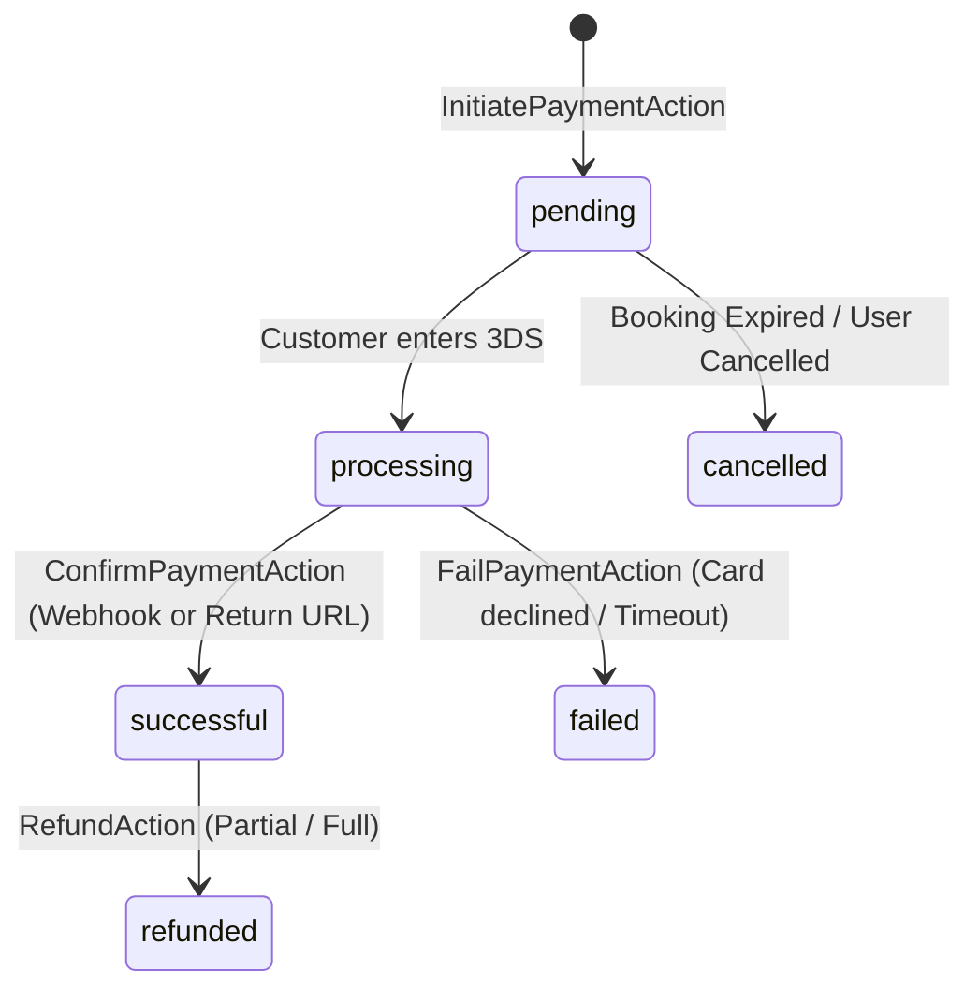

# Payment Processing & Webhook Reconciliation

## 1. Overview
The GouNow payment system abstracts payment gateways behind a unified interface (`PaymentGatewayInterface`). It ensures:
1. **Idempotency:** Webhooks and user return redirects cannot cause duplicate charges or double payments.
2. **Reconciliation:** Background webhooks ensure bookings are confirmed even if the guest closes their browser before returning.
3. **Auditability:** Every gateway attempt, charge ID, and status change is logged in `payment_transactions`.

---

## 2. Supported Payment Methods

| Method | Type | Workflow |
| :--- | :--- | :--- |
| **Credit / Debit Card** | Synchronous redirect + 3DS | Redirects customer to bank 3DS OTP verification. Callback returns to application; server reconciles with gateway. |
| **PayPal** | Express Checkout | Creates PayPal order, redirects customer to PayPal approval flow, captures order on return. |
| **Cash on Arrival** | Offline | Creates reservation in `pending` or `confirmed_offline` status. Admin can later record cash receipt. |
| **Bank Wire Transfer** | Offline | Displays bank account details and booking reference. Admin verifies receipt and records payment manually. |

---

## 3. Payment State Machine



---

## 4. Webhook Reconciliation & Idempotency

Payment gateways (Stripe, Paymob, PayPal, etc.) deliver webhooks asynchronously to ensure transaction completion. Webhook handlers in GouNow are guarded against replay attacks and duplicate processing:

### A. Webhook Signature Verification
Incoming webhooks to `/payment/webhook/{gateway}` verify HMAC cryptographic signatures before any business logic executes. Invalid signatures are rejected with HTTP 401.

### B. Idempotency Key & Event ID Deduplication
1. Each webhook provides a unique `event_id` (or `payment_intent_id`).
2. The `payment_transactions` table enforces a database-level unique constraint on `webhook_event_id`:
   ```sql
   ALTER TABLE payment_transactions ADD UNIQUE KEY (webhook_event_id);
   ```
3. If an identical event payload arrives a second time (due to network retries), the database unique constraint blocks duplicate insertion, or the `IdempotencyService` checks:
   ```php
   if ($this->idempotency->hasBeenProcessed($eventId)) {
       return response()->json(['status' => 'already_processed']);
   }
   ```

### C. Row-Level Transaction Locking
When a webhook confirms a payment:
```php
DB::transaction(function () use ($transactionId, $gatewayReference) {
    // 1. Lock the transaction record
    $transaction = PaymentTransaction::where('id', $transactionId)
        ->lockForUpdate()
        ->first();

    if ($transaction->status === 'successful') {
        return; // Idempotent exit
    }

    // 2. Mark transaction successful
    $transaction->update([
        'status' => 'successful',
        'gateway_reference' => $gatewayReference,
    ]);

    // 3. Update parent booking
    $booking = Booking::where('id', $transaction->booking_id)
        ->lockForUpdate()
        ->first();

    $booking->recordPayment(Money::cents($transaction->amount_cents));
});
```

---

## 5. Offline & Manual Admin Payments
For high-value luxury villa rentals or corporate events paid via bank wire, administrative users with the appropriate permissions can record payments manually:
- Action: `RecordManualPaymentAction`
- Requires: `booking_id`, `amount_cents`, `payment_method`, `notes`.
- Creates a `payment_transactions` record marked `successful` with `gateway = 'manual'`.
- Automatically checks if total paid meets `deposit_paid_cents` or `total_price_cents` and updates booking status accordingly.
