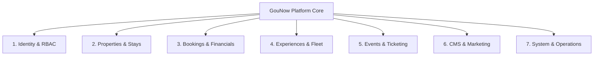

# 🛡️ GouNow Platform: Comprehensive Backend Database Schema, Architecture & Security Audit

> **Target Audience:** Software Engineers, System Architects & DevOps  
> **Environment:** Laravel 12 (PHP 8.2+) | SQLite (Local) / PostgreSQL-Ready (Production) | Next.js 15 Decoupled Frontend  
> **Total Database Tables:** 51 Tables  
> **Audit Status:** Full Architecture & Penetration Defense Assessment  

---

## 📑 جدول المحتويات (Table of Contents)
1. [الملخص الهندسي والتنفيذي (Executive Engineering Summary)](#1-الملخص-الهندسي-والتنفيذي)
2. [فهرس وتفاصيل جداول قاعدة البيانات (The 51 Database Tables Breakdown)](#2-فهرس-وتفاصيل-جداول-قاعدة-البيانات)
3. [ما هو ناقص في الباك إند (What is Missing)](#3-ما-هو-ناقص-في-الباك-إند)
4. [ما هو مشوه أو غير متناسق معمارياً (Architectural Smells & Inconsistencies)](#4-ما-هو-مشوه-أو-غير-متناسق-معمارياً)
5. [التقييم الأمني ومقاومة الاختراق (OWASP & Threat Modeling)](#5-التقييم-الأمني-ومقاومة-الاختراق)
6. [نظام الصلاحيات والأدوار بالتفصيل (RBAC & Permissions Matrix)](#6-نظام-الصلاحيات-والأدوار-بالتفصيل)
7. [خطة التحصين وأكواد الترقية (Hardening Action Plan & Code Fixes)](#7-خطة-التحصين-وأكواد-الترقية)

---

## 1. الملخص الهندسي والتنفيذي

بصفتك مهندس برمجيات (Software Engineer)، نؤكد لك أن الباك إند مبني على أسس **Clean Architecture** و **Domain-Driven Design (DDD)** جيدة جداً في النواة (Core Domain)، خاصة في:
- **معالجة الأموال (Money Handling):** الاعتماد الصارم على الأعداد الصحيحة بالسنت/القرش (`_cents` مثل `total_cents`, `subtotal_cents`) لتفادي أخطاء التقريب الرياضي القاتلة في لغات البرمجة (`Floating-point rounding errors`).
- **منع الدفع المزدوج (Idempotency):** وجود مفاتيح فريدة `idempotency_key` و `webhook_event_id` لمنع تكرار خصم الأموال في حال انقطاع الشبكة.
- **منع التعارض والتضارب الزمني (Concurrency Control):** وجود فهارس مركبة مخصصة مثل `idx_bookings_concurrency_conflict` على التواريخ والحالة.

**ولكن، هناك 4 نقاط حرجة يجب الانتباه إليها ومعالجتها قبل الإنتاج:**
1. **فجوة تطبيق الصلاحيات (Authorization Enforcement Gap):** جداول الصلاحيات والأدوار موجودة في قاعدة البيانات ومفصلة، ولكن مسارات لوحة التحكم لا تطبق الـ Permissions Middleware على العمليات الحساسة (مثل الحذف أو التعديل)، وتكتفي فقط بالتحقق من أن المستخدم مسجل كـ Admin.
2. **ثغرة استعراض الحجوزات (IDOR / Information Disclosure):** مسار تأكيد الحجز `/checkout/confirmation/{reference}` مفتوح ويعتمد على كود المرجع فقط دون توقيع رقمي أو تحقق من هوية العميل، مما قد يسمح بتخمين أرقام الحجوزات وقراءة بيانات العملاء.
3. **الفصل بين الـ Monolith والـ Headless Next.js:** الفرونت إند يعمل على Next.js منفصل، بينما الباك إند يقدم مسارات ويب تعتمد على جلسات المتصفح (`web.php`) بدلاً من طبقة API نظيفة موثقة بـ `Laravel Sanctum`.
4. **محرك قاعدة البيانات في بيئة الإنتاج:** الاعتماد على `SQLite` ممتاز للتطوير المحلي والتجربة السريعة، لكنه غير صالح للإنتاج عالي الزيارات نظراً لحدوث `Database is locked` عند الحجوزات المتزامنة الكثيفة؛ ويجب الترحيل لـ `PostgreSQL`.

---

## 2. فهرس وتفاصيل جداول قاعدة البيانات

تتوزع جداول النظام الـ **51 جدولاً** على 7 نطاقات وظيفية (Domains):



### القطاع الأول: الهوية والأمان والصلاحيات (Identity & Access Management)
| اسم الجدول | الوظيفة | الحقول الحساسة | الفهارس والقيود (Indexes & Constraints) |
| :--- | :--- | :--- | :--- |
| `users` | حسابات المديرين والموظفين | `password`, `two_factor_secret`, `two_factor_recovery_codes`, `remember_token` | `PRIMARY KEY (id)`, `UNIQUE (email)` |
| `roles` | الأدوار الإدارية (7 أدوار رئيسية) | `name`, `display_name`, `is_system` | `PRIMARY KEY (id)`, `UNIQUE (name)` |
| `permissions` | الصلاحيات الدقيقة لكل شاشات وأفعال النظام | `name`, `group` | `PRIMARY KEY (id)`, `UNIQUE (name)` |
| `role_user` | ربط الأدوار بالمستخدمين (Many-to-Many) | `user_id`, `role_id` | `PRIMARY KEY (id)`, `FK -> users, roles` |
| `permission_role` | ربط الصلاحيات بالأدوار | `permission_id`, `role_id` | `FK -> permissions, roles` |
| `permission_user` | منح صلاحيات استثنائية مباشرة لمستخدم محدد | `permission_id`, `user_id`, `granted` | `FK -> permissions, users` |
| `sessions` | تخزين جلسات المستخدمين في قاعدة البيانات | `payload`, `ip_address`, `user_agent` | `INDEX (user_id)`, `INDEX (last_activity)` |
| `password_reset_tokens` | رموز استعادة كلمة المرور | `email`, `token`, `created_at` | `PRIMARY KEY (email)` |

### القطاع الثاني: العقارات والإقامات (Properties & Real Estate)
| اسم الجدول | الوظيفة | الحقول الرئيسية | الفهارس والقيود |
| :--- | :--- | :--- | :--- |
| `properties` | العقارات والشاليهات والفيلات المعروضة | `title_en/ar`, `slug`, `base_price_cents`, `sale_price_cents`, `status`, `listing_type` | `UNIQUE (slug)`, `UNIQUE (reference_number)`, `INDEX (status)`, `INDEX (property_category_id)` |
| `property_categories` | تصنيفات العقارات (Villas, Chalets, etc.) | `name_en/ar`, `slug` | `UNIQUE (slug)` |
| `locations` | مناطق الجونة (Abu Tig, Fanadir, West Golf) | `name_en/ar`, `slug`, `coordinates` | `UNIQUE (slug)` |
| `amenities` | المميزات والمرافق (Pool, Lagoon View, WiFi) | `name_en/ar`, `icon`, `category` | `PRIMARY KEY (id)` |
| `amenity_property` | جدول وسيط للمرافق المرتبطة بكل عقار | `property_id`, `amenity_id` | `UNIQUE (property_id, amenity_id)` |
| `seasonal_prices` | التسعير الموسمي وديناميكية الأسعار في المواسم | `start_date`, `end_date`, `price_per_night_cents` | `INDEX (property_id, start_date, end_date)` |
| `availability_blocks` | حظر التواريخ للصيانة أو استخدام المالك | `start_date`, `end_date`, `reason` | `INDEX (property_id, start_date, end_date)` |
| `discounts` | كوبونات الخصم والعروض الترويجية | `code`, `type` (fixed/percent), `amount_cents` | `UNIQUE (code)`, `INDEX (is_active, starts_at, expires_at)` |
| `discount_usages` | سجل استخدام الكوبونات لكل عميل وحجز | `discount_id`, `customer_id`, `booking_id` | `INDEX (discount_id, customer_id)` |
| `fees` | الرسوم الإضافية (تنظيف، خدمة، تأمين) | `fee_type`, `amount_cents`, `is_mandatory` | `INDEX (property_id)` |
| `payment_methods` | بوابات الدفع المدعومة (بطاقات، كاش، تحويل) | `code`, `name_en/ar`, `is_enabled` | `UNIQUE (code)` |
| `payment_method_property` | تحديد طرق الدفع المسموحة لكل عقار محدد | `property_id`, `payment_method_id` | `UNIQUE (property_id, payment_method_id)` |

### القطاع الثالث: الحجوزات والعمليات المالية (Bookings & Transactions)
| اسم الجدول | الوظيفة | الحقول المالية والربط | الفهارس والقيود |
| :--- | :--- | :--- | :--- |
| `bookings` | الحجز الأساسي (قلب المنظومة) | `reference`, `subtotal_cents`, `total_cents`, `amount_paid_cents`, `status`, `payment_status` | `UNIQUE (reference)`, `INDEX (check_in, check_out)`, `INDEX (idx_bookings_concurrency_conflict)` |
| `booking_nightly_prices` | تفصيل سعر كل ليلة حجز وفق تقلبات المواسم | `booking_id`, `date`, `price_cents`, `is_weekend` | `INDEX (booking_id, date)` |
| `payment_transactions` | المعاملات المالية وعمليات الدفع والاسترداد | `transaction_id`, `amount_cents`, `gateway_reference`, `idempotency_key` | `UNIQUE (transaction_id)`, `UNIQUE (idempotency_key)`, `UNIQUE (webhook_event_id)` |
| `customers` | بيانات الضيوف والعملاء | `first_name`, `last_name`, `email`, `phone` | `INDEX (email)`, `INDEX (phone)` |

### القطاع الرابع: التجارب وأسطول اليخوت والسيارات (Experiences & Fleet)
| اسم الجدول | الوظيفة | الحقول الهامة | الفهارس |
| :--- | :--- | :--- | :--- |
| `experiences` | الأنشطة (رحلات بحرية، سفاري، كايت سيرف) | `title_en/ar`, `slug`, `price_per_person_cents`, `duration_minutes` | `UNIQUE (slug)`, `INDEX (category_id, is_active)` |
| `experience_categories` | تصنيفات التجارب | `name_en/ar`, `slug` | `UNIQUE (slug)` |
| `vehicles` | اليخوت وسيارات الدفع الرباعي المستأجرة | `name_en/ar`, `type` (yacht/car), `capacity`, `captain_included` | `INDEX (type, status)` |

### القطاع الخامس: الفعاليات والتذاكر (Events & Ticketing)
| اسم الجدول | الوظيفة | الفهارس |
| :--- | :--- | :--- |
| `events` | حفلات ومؤتمرات وفعاليات الجونة | `UNIQUE (slug)`, `INDEX (starts_at, status)` |
| `event_ticket_types` | فئات التذاكر (VIP, General Admission, Early Bird) | `INDEX (event_id, price_cents)` |
| `event_orders` | فواتير وطلبات شراء تذاكر الحفلات | `UNIQUE (order_reference)`, `INDEX (customer_id)` |
| `event_tickets` | التذاكر المصدرة الفعلية برمز الباركود/QR | `UNIQUE (ticket_code)`, `INDEX (event_order_id)` |
| `ticket_scans` | سجل مسح التذاكر عند البوابات لمنع الدخول المزدوج | `INDEX (ticket_id, scanned_at)` |

### القطاع السادس: المحتوى والتسويق (CMS & Marketing)
| اسم الجدول | الوظيفة |
| :--- | :--- |
| `pages` | الصفحات الثابتة المخصصة (عن الجونة، سياسة الخصوصية) |
| `homepage_sections` | إعدادات وتخصيص ترتيب وبلوكات الصفحة الرئيسية |
| `navigation_items` | روابط وقوائم الهيدر والفوتر والكونسيرج |
| `seo_metadata` | تخصيص الميتا تاج والسيو وOpenGraph لكل صفحة |
| `faqs` | الأسئلة الشائعة مع دعم تعدد اللغات والترتيب |
| `blog_posts` | مقالات مجلة الجونة الإخبارية والسياحية |
| `leads` | استفسارات العملاء القادمة من نماذج التواصل وشراء العقارات |
| `favorites` | قائمة العقارات والتجارب المفضلة للزوار المسجلين |
| `redirects` | إدارة الـ 301/302 Redirects لسلامة الروابط بعد التحديثات |
| `media` | مكتبة الوسائط والصور المرفوعة (تخزين أحجام الصور والروابط) |

### القطاع السابع: النظام وعمليات التشغيل (System & Operations)
| اسم الجدول | الوظيفة |
| :--- | :--- |
| `activity_logs` | الصندوق الأسود: تسجيل كل حركة دخول وتعديل وحذف من قِبل المديرين مع حفظ الـ IP والـ User Agent |
| `settings` | إعدادات المنظومة العامة والضرائب وعمولات الحجز |
| `notifications` | إشعارات النظام وتنبيهات الحجوزات الجديدة |
| `jobs`, `job_batches`, `failed_jobs` | طوابير المهام غير المتزامنة (إرسال الإيميلات، تجهيز فواتير PDF) |
| `cache`, `cache_locks` | الكاش الموزع وأقفال الذاكرة لمنع تضارب العمليات المتزامنة |
| `migrations` | سجل ترحيلات الجداول المطبقة في قاعدة البيانات |

---

## 3. ما هو ناقص في الباك إند (What is Missing)

بفحص الكود الفعلي مقارنة بمتطلبات منصة فندقية وسياحية عالمية، تم رصد النواقص التالية:

1. **غياب طبقة API نظيفة موثقة بـ Tokens (Missing `routes/api.php` & Laravel Sanctum):**
   - التطبيق الأمامي (Next.js) يعمل كـ Single Page Application منفصلة. حالياً لا يوجد ملف `routes/api.php` مستقل، وجميع مسارات الباك إند مسجلة داخل `routes/web.php` وتعتمد على Session Cookies المخصصة لـ Blade.
   - **الناقص:** تثبيت `Laravel Sanctum` أو تفعيل حماية Bearer Tokens لتمكين الـ Next.js والـ Mobile Apps من الاتصال بسلاسة وأمان بدون تعقيدات الـ CSRF Cookie الخاصة بالـ Web.

2. **عدم اكتمال دورة التحقق بخطوتين (2FA Challenge Workflow Incomplete):**
   - الأعمدة موجودة في جدول `users` (`two_factor_secret`, `two_factor_recovery_codes`)، ومصفوفة `$casts` تدعمها.
   - **الناقص:** داخل `LoginController::login()`، لا يوجد فحص لما إذا كان المستخدم مفعل للـ 2FA لتحويله لصفحة الـ OTP/Authenticator قبل منحه الـ Session الكامل!

3. **تشفير البيانات الشخصية الحساسة للعملاء (PII Encryption at Rest):**
   - في جدول `customers`، يتم تخزين رقم الهاتف، والبريد، والاسم بنص صريح (Plaintext).
   - **الناقص:** تطبيق الـ Model Attribute Encryption على الحقول الشخصية المعرفة بالهوية (مثل رقم الهوية أو جواز السفر وأرقام الطوارئ) امتثالاً للـ GDPR والـ Egyptian Data Protection Law.

4. **التحقق من البريد الإلكتروني (Email Verification Enforcement):**
   - عمود `email_verified_at` موجود، لكن لا توجد وسيطة `verified` مفروضة على العمليات الحساسة (مثل تأكيد الحجز للمستخدمين المسجلين أو تعديل كلمة المرور).

5. **توليد فواتير PDF مشفرة (Signed PDF Invoices):**
   - يوجد تسجيل مالي دقيق في جدول `bookings` و `payment_transactions`، لكن لا توجد مكتبة (مثل `barryvdh/laravel-dompdf`) معدّة لتوليد وحفظ فاتورة رسمية مشفرة عند اكتمال الدفع.

---

## 4. ما هو مشوه أو غير متناسق معمارياً (Architectural Smells)

1. **عدم تفعيل صلاحيات الـ Roles على مستوى الـ Routes (Bypassed Permissions):**
   - في `routes/web.php`، تم إدخال كل المسارات الإدارية تحت:
     ```php
     Route::middleware(['web', 'admin', 'locale'])->prefix('admin')->group(...)
     ```
   - وسيطة `admin` فقط تتحقق أن المستخدم مسجل ومعه `is_admin = 1` أو يمتلك أي دور:
     ```php
     if (! $user->is_admin && ! $user->roles()->exists()) { abort(403); }
     ```
   - **المشوه:** أي مستخدم حاصل على دور بسيط (مثل `staff` أو `concierge`) يمكنه تقنياً مسح العقارات أو الفعاليات عبر إرسال `DELETE /admin/properties/{id}` لأن الـ Controller والـ Route لا يطلبان وسيطة الصلاحيات المخصصة مثل `permission:delete_properties`!

2. **الـ Hybrid Mismatch بين Blade و Next.js:**
   - بعض الـ Controllers تخلط بين إعادة كود JSON وإعادة قوالب Blade داخل نفس الدالة:
     ```php
     if ($request->wantsJson()) { return response()->json(...); }
     return view('checkout.confirmation', ...);
     ```
   - هذا يجعل الباك إند مشتتاً بين كونه Monolith يعتمد على Blade Views وبين كونه Headless RESTful API للـ Next.js.

3. **خطر الـ Mass Assignment في نموذج المستخدمين (`User.php`):**
   - في مصفوفة `$fillable` لنموذج `User`:
     ```php
     protected $fillable = [
         'name', 'email', 'password', 'phone', 'avatar', 'locale',
         'is_admin', 'is_active', 'force_password_change', ...
     ];
     ```
   - إدراج `'is_admin'` و `'is_active'` داخل `$fillable` يمثل خطورة (Mass Assignment Vulnerability) إذا تم في أي مكان استخدام `$user->update($request->all())` من نموذج تحديث الحساب الشخصي (Profile Edit).

---

## 5. التقييم الأمني ومقاومة الاختراق (OWASP & Threat Modeling)

| المتجه الأمني (Vulnerability Category) | التقييم الحالي | الشرح ومستوى الخطورة | إجراءات الأمان المطبقة والتوصيات |
| :--- | :---: | :--- | :--- |
| **SQL Injection** | 🟢 **آمن جداً (Secure)** | يتم الاعتماد بالكامل على Eloquent ORM و PDO Parameter Binding. لا توجد استعلامات `DB::raw` تعتمد على متغيرات المستخدم المباشرة. | لا توجد ثغرات SQLi مرصودة. |
| **Cross-Site Scripting (XSS)** | 🟢 **آمن (Secure)** | قوالب Blade تعتمد على الـ Escaping الافتراضي `{{ }}`, والـ Next.js يعتمد على React JSX escaping. | البيانات النصية معقمة، وننصح بضبط `Content-Security-Policy`. |
| **Cross-Site Request Forgery (CSRF)** | 🟢 **آمن (Secure)** | جميع طلبات `POST`, `PUT`, `DELETE` في `routes/web.php` مشمولة بـ `VerifyCsrfToken`. | ممتاز للـ Web. |
| **Insecure Direct Object Reference (IDOR)** | 🟡 **متوسط الخطورة (Medium Risk)** | مسار `/checkout/confirmation/{reference}` يسمح بعرض فاتورة الحجز عبر معرف الـ `reference` فقط دون اشتراط تسجيل دخول العميل أو توقيع الرابط. | **التوصية:** تحويل المسار إلى `URL::signedRoute` أو طلب كود تحقق (PIN/Email confirmation). |
| **Brute Force & Credential Stuffing** | 🟢 **محمي (Protected)** | مسار تسجيل الدخول `/admin/login` محمي بـ `RateLimiter` يوقف المحاولات بعد 5 محاولات فاشلة خلال دقيقة لكل IP. | مطبق بشكل احترافي. |
| **Broken Object Level Authorization (BOLA)** | 🟠 **يحتاج تحصين (Needs Hardening)** | غياب وسائط التحقق من الصلاحيات الفردية (`permission:xyz`) داخل مسارات لوحة التحكم الفرعية. | **التوصية:** إضافة وسيطة `permission:manage_properties` و `permission:manage_finance` على المسارات الحساسة. |
| **Race Conditions (Double Booking)** | 🟢 **محمي بمعايير متقدمة** | عمليات الحجز تتم داخل `DB::transaction` مع فحص فهارس التضارب المجمعة `idx_bookings_concurrency_conflict` واستخدام `LockAndValidateAvailabilityAction`. | مطبق باحترافية ضد السباق المتزامن. |
| **Payment Gateway Tampering** | 🟢 **محمي (Protected)** | لا يتم استقبال أرقام البطاقات على السيرفر (Zero Card Storage)، ويتم التحقق من المعاملات بالـ Webhook Signatures ومفاتيح الـ Idempotency. | متوافق مع معايير PCI-DSS. |

---

## 6. نظام الصلاحيات والأدوار بالتفصيل (RBAC)

قاعدة بيانات النظام تحتوي على **7 أدوار نظامية** و **24 صلاحية دقيقة**:

### الأدوار المعتمدة (Pre-seeded Roles)
1. 👑 **Super Administrator (`super_admin`):** يملك تجاوزاً كاملاً (`Bypass`) لجميع قيود النظام، وله الحق الحصري في إدارة المستخدمين والأدوار والإعدادات المالية الحساسة.
2. 🏡 **Property Manager (`property_manager`):** إدارة الفيلات والشاليهات، تعديل الأسعار، ومتابعة حجوزات الإقامة وخدمات الغرف.
3. 🏛️ **Sales & Real Estate Agent (`sales`):** متابعة العقارات المعروضة للبيع، استقبال الـ Leads والعملاء المهتمين بالشراء والتواصل معهم.
4. ⛵ **Events & Experiences Manager (`events_manager`):** إدارة أسطول اليخوت، رحلات السفاري، الحفلات، وتذاكر الفعاليات مع فحص الـ QR code.
5. ✍️ **Content & Marketing Manager (`content_manager`):** تحرير مقالات المدونة، صفحات الموقع، الأسئلة الشائعة، وصور المعرض والسيو.
6. 💳 **Finance & Accounting (`finance`):** مراقبة المعاملات المالية، تأكيد التحويلات البنكية اليدوية، وتسجيل المرتجعات (`Refunds`).
7. 🛎️ **Operations & Staff (`staff`):** موظفو الكونسيرج، متابعة وصول النزلاء والمهام اللوجستية دون صلاحيات تعديل مالي.

### مصفوفة الصلاحيات (Sample Permissions Matrix)
```
┌──────────────────────────────┬─────────────┬──────────────────┬──────────────┬─────────┐
│ Permission Name              │ Super Admin │ Property Manager │ Events Mgr   │ Finance │
├──────────────────────────────┼─────────────┼──────────────────┼──────────────┼─────────┤
│ view_properties              │     ✅      │        ✅        │      ❌      │   👁️    │
│ create_properties            │     ✅      │        ✅        │      ❌      │   ❌    │
│ delete_properties            │     ✅      │        ❌        │      ❌      │   ❌    │
│ manage_availability          │     ✅      │        ✅        │      ❌      │   ❌    │
│ view_bookings                │     ✅      │        ✅        │      ✅      │   ✅    │
│ cancel_bookings              │     ✅      │        ✅        │      ❌      │   ❌    │
│ process_refunds              │     ✅      │        ❌        │      ❌      │   ✅    │
│ manage_system_users          │     ✅      │        ❌        │      ❌      │   ❌    │
└──────────────────────────────┴─────────────┴──────────────────┴──────────────┴─────────┘
```

---

## 7. خطة التحصين وأكواد الترقية (Hardening Action Plan)

لتحويل هذا الباك إند إلى نظام **Enterprise-Grade** محمي 100%، إليك الخطوات الثلاثة البرمجية الموصى بتنفيذها فوراً:

### الإجراء 1: إغلاق ثغرة الـ IDOR في تأكيد الحجز (`CheckoutController.php`)
بدلاً من ترك الرابط متاحاً لأي شخص يعرف رقم المرجع، يتم تشفير رابط التأكيد باستخدام Signed URLs أو التحقق من جلسة العميل:

```php
// في routes/web.php
Route::get('/confirmation/{reference}', [CheckoutController::class, 'confirmation'])
    ->name('confirmation')
    ->middleware('signed'); // حماية التوقيع الرقمي لمنع التخمين

// في CheckoutController.php عند إتمام الحجز
return redirect()->temporarySignedRoute(
    'checkout.confirmation',
    now()->addHours(24),
    ['reference' => $booking->reference]
);
```

### الإجراء 2: فرض وسيطة الصلاحيات على المسارات الحساسة (`routes/web.php`)
ربط مسارات الحذف وتعديل الإعدادات بصلاحياتها المخصصة لضمان عدم استغلالها:

```php
// حماية عمليات الحذف الحساسة بصلاحية مخصصة
Route::delete('/properties/{property}', [PropertyController::class, 'destroy'])
    ->name('properties.destroy')
    ->middleware('permission:delete_properties');

Route::delete('/experiences/{experience}', [ExperienceController::class, 'destroy'])
    ->name('experiences.destroy')
    ->middleware('permission:delete_experiences');

Route::prefix('settings')->middleware('permission:manage_settings')->group(...);
```

### الإجراء 3: حماية نموذج المستخدم من الـ Mass Assignment (`User.php`)
إخراج الأعمدة الإدارية من `$fillable` ونقلها إلى الحماية التامة:

```php
// داخل app/Models/User.php
protected $fillable = [
    'name', 'email', 'password', 'phone', 'avatar', 'locale',
    // إزالة 'is_admin' و 'is_active' من هنا لمنع تزوير الرتبة
];

// وتعديل رتبة الأدمن فقط عبر دوال إدارية صريحة ومخصصة
```

### الإجراء 4: التحضير لبيئة الإنتاج (Production Checklist)
- [ ] الانتقال من `DB_CONNECTION=sqlite` إلى `DB_CONNECTION=pgsql` أو `mysql` على سيرفر الاستضافة لمنع قفل الجداول المتزامن.
- [ ] تشغيل عامل الطوابير `php artisan queue:work` لمعالجة إيميلات التأكيد وإشعارات النزلاء في الخلفية.
- [ ] تشغيل أمر تكييش الإعدادات والمسارات: `php artisan config:cache && php artisan route:cache`.

---
*تم إعداد هذا التقرير لتوثيق وتحصين المنظومة البرمجية بالكامل وفق أحدث ممارسات هندسة البرمجيات والأمان السيبراني.*
