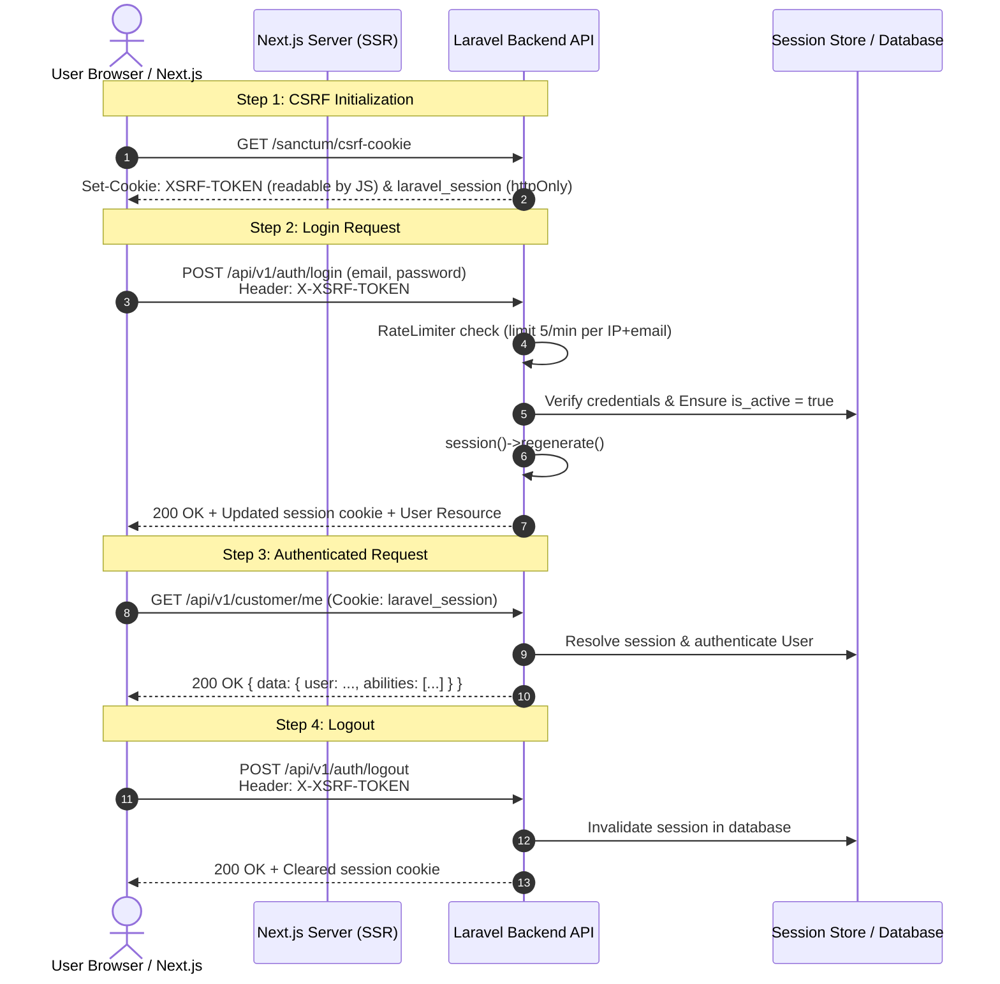
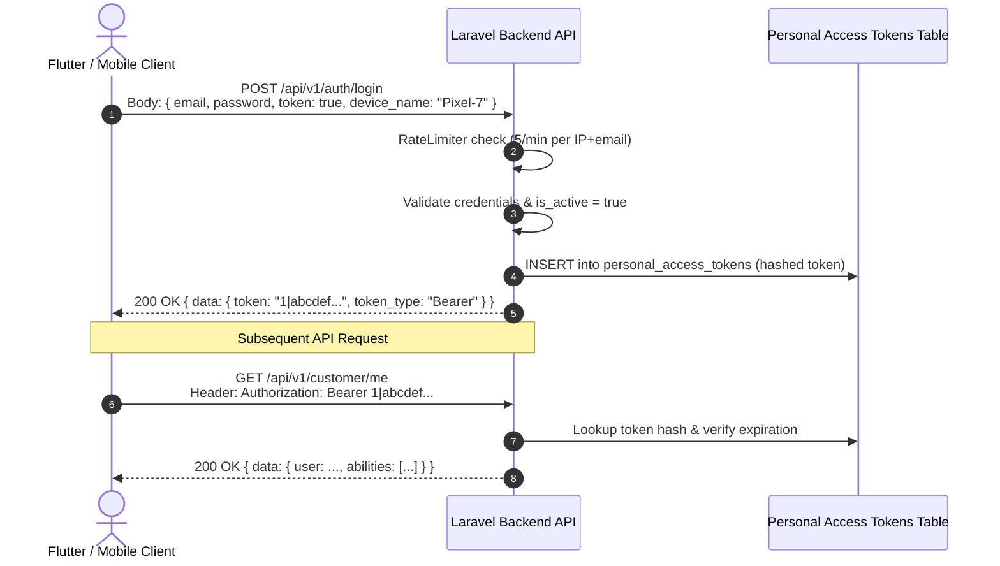

# GouNow Authentication & Session Architecture (ADR-003)

> **Document Status**: IMPLEMENTED & TESTED  
> **Target Boundaries**: Next.js 14 App (`frontend/`), Laravel 12 API (`backend/`), Mobile Clients

---

## 1. Authentication Modalities

The GouNow platform implements a dual-mode authentication architecture governed by Laravel Sanctum:

1. **SPA Session Cookie Mode (Primary for Web & Next.js)**:
   - Next.js web application interacts using `httpOnly`, `SameSite=Lax`, `Secure` session cookies.
   - CSRF protection via Laravel's double-submit `/sanctum/csrf-cookie` endpoint and `X-XSRF-TOKEN` header.
   - Zero storage of credentials in `localStorage` or `sessionStorage` (preventing XSS credential theft).

2. **Bearer Token Mode (Primary for Native Mobile / External Partners)**:
   - Native mobile applications (Flutter) or server-to-server partners authenticate via `POST /api/v1/auth/login` with `token=true`.
   - Backend issues a cryptographically secure Sanctum personal access token.
   - Token is passed via `Authorization: Bearer <plainTextToken>` header.

---

## 2. SPA Session Authentication Lifecycle (Mermaid)



---

## 3. Personal Access Token Lifecycle (Mermaid)



---

## 4. Rate Limiting Safeguards

To defeat credential stuffing and brute-force attacks:
- The `auth` named rate limiter enforces a strict ceiling of **5 attempts per minute per IP + email address combination**.
- Upon reaching the limit, the server immediately emits an HTTP 429 response:
  ```json
  {
    "error": {
      "code": "RATE_LIMIT_EXCEEDED",
      "message": "Too many login attempts. Please try again later.",
      "details": { "retry_after": 48 },
      "request_id": "9b1deb4d-3b7d-4bad-9bdd-2b0d7b3dcb6d",
      "timestamp": "2026-10-02T22:45:00Z"
    }
  }
  ```
  Accompanied by the standard HTTP header `Retry-After: 48`.
