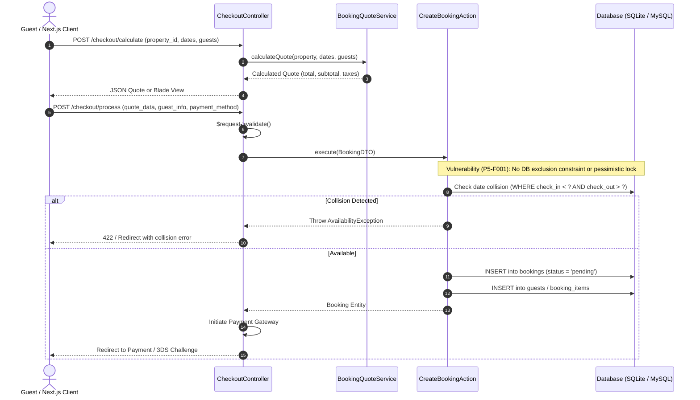
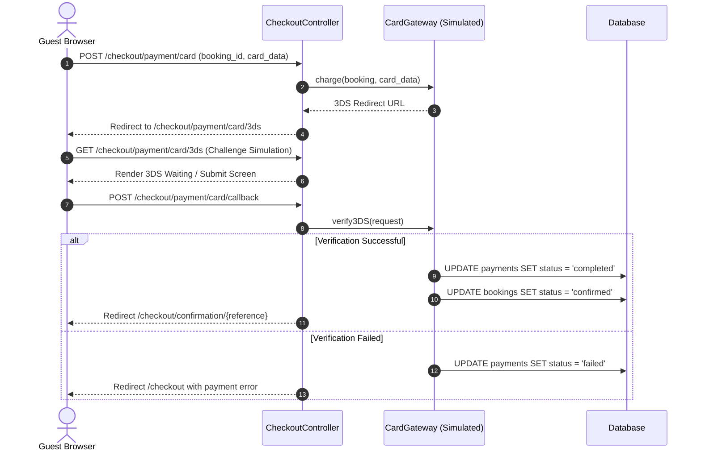

# GouNow Current Architecture Reality (P1-T14)

> **Document Status**: VERIFIED against active codebase as of 2026-10-02  
> **Source Baseline**: Laravel 12.x Backend (`backend/`) & Next.js 14.x Frontend (`frontend/`)

This document diagrams the **actual code reality** discovered during Phase 1 static analysis and execution characterization. It depicts what is currently implemented, including architectural debt, coupled flows, and missing layers.

---

## 1. Request Lifecycle Flow

Currently, incoming web requests traverse a minimal Laravel 12 pipeline configured in `bootstrap/app.php` and `routes/web.php`.

```mermaid
flowchart TD
    Client([HTTP Client / Browser / Next.js]) -->|HTTP Request| Nginx[Web Server / Nginx]
    Nginx --> PublicIndex[backend/public/index.php]
    PublicIndex --> Bootstrap[bootstrap/app.php]
    
    subgraph GlobalMiddleware [Global Middleware Pipeline]
        Bootstrap --> EncryptCookies[EncryptCookies]
        EncryptCookies --> AddQueuedCookies[AddQueuedCookiesToResponse]
        AddQueuedCookies --> StartSession[StartSession]
        StartSession --> ShareErrors[ShareErrorsFromSession]
        ShareErrors --> VerifyCsrf[ValidateCsrfToken]
        VerifyCsrf --> SubBindings[SubstituteBindings]
        SubBindings --> Locale[App\\Http\\Middleware\\SetLocale]
    end

    Locale --> Router{Route Matching}
    
    Router -->|Public Web / API| WebController[Web Controllers\n(HomeController, StaysController, etc.)]
    Router -->|Admin Web| AdminCheck{Middleware: admin}
    
    AdminCheck -->|Unauthorized / Guest| RedirectLogin[Redirect to /admin/login]
    AdminCheck -->|is_admin = true| AdminController[Admin Controllers\n(Admin\\PropertyController, etc.)]

    subgraph ControllerExecution [Controller Handling]
        WebController --> HybridCheck{wantsJson()?}
        HybridCheck -->|Yes (Next.js)| JsonPayload[Direct JSON Response\n(response()->json(...))]
        HybridCheck -->|No (Browser)| BladeView[Blade View Render\n(view('...'))]
        
        AdminController --> DirectEloquent[Direct Eloquent / DB Calls]
        DirectEloquent --> AdminBladeView[Blade Admin View Render]
    end

    JsonPayload --> Client
    BladeView --> Client
    AdminBladeView --> Client
```

---

## 2. Authentication & Session Flow

Authentication is bifurcated between standard Web Sessions and Sanctum API tokens, with administrative access controlled by the custom `AdminMiddleware`.

```mermaid
flowchart TD
    User([User / Admin]) -->|POST /admin/login| LoginController[App\\Http\\Controllers\\Auth\\LoginController@login]
    
    subgraph AuthValidation [Login Processing]
        LoginController --> ValidateReq[Inline Validation:\nemail, password, remember]
        ValidateReq --> ThrottleCheck{Throttle: admin_login\n5 attempts / 1 min}
        ThrottleCheck -->|Exceeded| ThrottleLockout[429 / Lockout Response]
        ThrottleCheck -->|Allowed| AttemptAuth[Auth::attempt($credentials)]
    end

    AttemptAuth -->|Credentials Fail| LoginError[Redirect back with error]
    AttemptAuth -->|Credentials Pass| CheckAdminStatus{User::is_admin == true\nOR role == 'admin'}
    
    CheckAdminStatus -->|False| LogoutUnauth[Auth::logout() -> 403 / Redirect]
    CheckAdminStatus -->|True| RegenerateSession[session()->regenerate()]
    
    RegenerateSession --> SetSessionCookie[Set laravel_session Cookie]
    SetSessionCookie --> RedirectDash[Redirect /admin]

    subgraph ProtectedAccess [Protected Admin Route Access]
        ReqWithCookie([Admin Request]) --> CookieCheck[StartSession]
        CookieCheck --> AdminMiddleware[App\\Http\\Middleware\\AdminMiddleware]
        AdminMiddleware --> VerifyUser{Auth::check() &&\n(user->is_admin || user->role === 'admin')}
        VerifyUser -->|No| RejectAdmin[Abort 403 / Redirect]
        VerifyUser -->|Yes| NextAction[Pass to Admin Controller Action]
    end
```

---

## 3. Authorization Reality (The Coarse Gate)

In the current state, administrative routes rely entirely on a binary gate rather than granular permissions or policies.

```mermaid
flowchart LR
    subgraph CurrentReality [Current Binary Authorization]
        Request[Incoming Route] --> AdminMW[AdminMiddleware]
        AdminMW --> RoleCheck{user.is_admin == true?}
        RoleCheck -->|Yes| AllAccess[Access ALL Admin Resources\n(Properties, Bookings, Events, CMS, Settings)]
        RoleCheck -->|No| Denied[403 Forbidden]
    end

    subgraph MissingCapabilities [Architectural Deficits (Resolved in P3)]
        RoleCheck -.-> NoRBAC[No Role Hierarchy]
        RoleCheck -.-> NoPermissions[No 'properties.create', 'booking.refund' permissions]
        RoleCheck -.-> NoPolicies[No PropertyPolicy or BookingPolicy]
        RoleCheck -.-> NoScopeBindings[No Nested Route BOLA Protection]
    end
```

---

## 4. Booking & Availability Engine Flow

The booking flow is orchestrated via `CheckoutController` and the `CreateBookingAction`.



---

## 5. Payment Processing & Callback Flow

Currently, card payments simulate 3DS verification and callback handling.



---

## 6. Admin Management & Media Upload Flow

Admin actions use direct Eloquent model persistence and local filesystem storage.

```mermaid
flowchart TD
    AdminUser([Admin User]) -->|POST /admin/properties| AdminPropCtrl[App\\Http\\Controllers\\Admin\\PropertyController@store]
    
    subgraph RequestValidation [Request Handling]
        AdminPropCtrl --> InlineValidation["$request->validate([\n  'title' => 'required',\n  'price_per_night' => 'required|numeric',\n  'photos.*' => 'image|max:10240'\n])"]
    end

    InlineValidation --> DBTransaction[DB::transaction]
    
    subgraph Persistence [Data Persistence]
        DBTransaction --> CreateProperty[Property::create($validated)]
        DBTransaction --> ProcessMedia{Photos present?}
        
        ProcessMedia -->|Yes| StoragePut["$file->store('properties', 'public')"]
        StoragePut --> InsertMediaRecord["Media::create([\n  model_type: Property,\n  model_id: property.id,\n  file_path: path\n])"]
        ProcessMedia -->|No| CompleteTx[Commit Transaction]
        InsertMediaRecord --> CompleteTx
    end

    CompleteTx --> RedirectIndex[Redirect /admin/properties with flash message]
```

---

## 7. Summary of Current Deficits Identified in Reality

1. **Hybrid Web Controllers**: `CheckoutController` and `ExperienceListingController` return different shapes based on `$request->wantsJson()`, mixing Presentation concerns with API serialization.
2. **Missing FormRequests**: Critical admin mutations (Properties, Events, Experiences) rely on inline `$request->validate()`, creating controller bloat and preventing reusable authorization hooks.
3. **No Idempotency Guards**: Mutations in `/checkout/process` and payment operations lack UUID idempotency checks, leaving transactions vulnerable to network retries and duplicate charges.
4. **Coarse Role Check**: Administrative security is a single boolean (`is_admin`) with no granular permission verification or model policies.
5. **Concurrency Gap**: Room and villa bookings lack PostgreSQL exclusion constraints and table-level locking, exposing the system to double-booking under race conditions.
