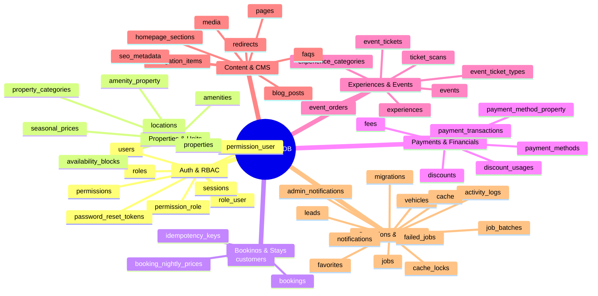
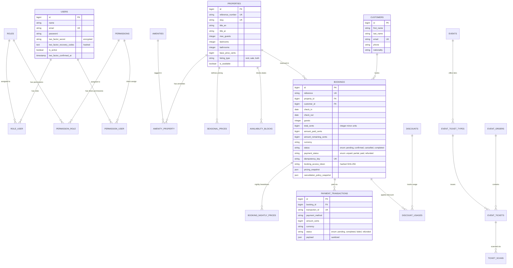
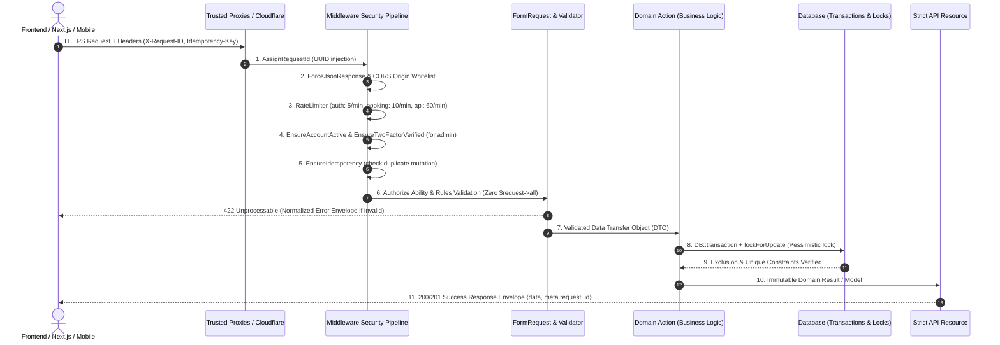
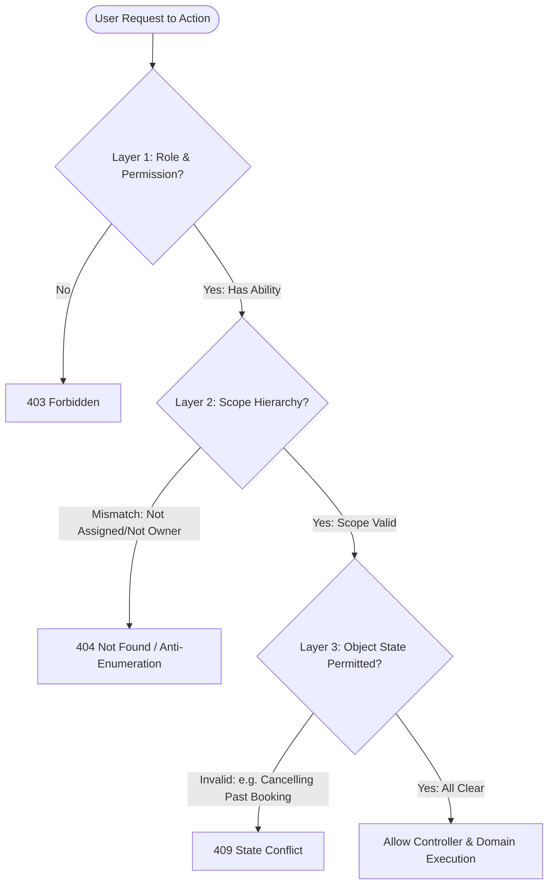

# 🗄️ Database Schema & Security Architecture Blueprint (GouNow)

> **وثيقة معمارية شاملة:** توضح تصنيف جداول قاعدة البيانات (51 جدول)، العلاقات والروابط (ERD)، ومصفوفة الأمان والحماية التابعة للباك إند ومنظومة الـ API.

---

## 1. تصنيف الجداول والـ Domains (51 Tables Overview)

تم تصنيف جداول قاعدة البيانات إلى **7 مجالات وظيفية (Domains)** مترابطة:

### تفاصيل المجالات الـ 7:

| المجال (Domain) | الجداول التابعة | الدور الوظيفي | درجة الحساسية الأمنية |
|---|---|---|---|
| **1. Auth & RBAC** | `users`, `roles`, `permissions`, `role_user`, `permission_role`, `permission_user`, `sessions`, `password_reset_tokens` | إدارة الهوية، الأدوار الـ 7، الصلاحيات الـ 24، الجلسات ورموز الاستعادة والـ 2FA | **عالية جداً (Critical)** |
| **2. Properties & Inventory** | `properties`, `property_categories`, `amenities`, `amenity_property`, `locations`, `seasonal_prices`, `availability_blocks` | العقارات المتاحة للإيجار والبيع، التسعير الموسمي، بلوكات التوفر والتعطيل | **متوسطة إلى عالية** |
| **3. Bookings & Reservations** | `bookings`, `booking_nightly_prices`, `customers`, `idempotency_keys` | محرك الحجز، حساب الليالي، إدارة بيانات العملاء، ومنع التكرار بـ Idempotency | **عالية جداً (Financial & PII)** |
| **4. Payments & Financials** | `payment_methods`, `payment_method_property`, `payment_transactions`, `fees`, `discounts`, `discount_usages` | العمليات المالية، بوابات الدفع (Cards, PayPal, Cash)، الكوبونات والرسوم | **عالية جداً (Financial)** |
| **5. Experiences & Events** | `experiences`, `experience_categories`, `events`, `event_ticket_types`, `event_tickets`, `event_orders`, `ticket_scans` | الأنشطة البحرية والصحراوية، الفعاليات وحفلات الجونة، التذاكر والمسح بالباركود | **متوسطة** |
| **6. Content & CMS** | `pages`, `blog_posts`, `faqs`, `homepage_sections`, `navigation_items`, `redirects`, `seo_metadata`, `media` | إدارة المحتوى، المقالات، الأسئلة الشائعة، الوسائط والصور والـ SEO | **منخفضة إلى متوسطة** |
| **7. System & Operations** | `leads`, `activity_logs`, `admin_notifications`, `notifications`, `favorites`, `vehicles`, `cache`, `cache_locks`, `jobs`, `job_batches`, `failed_jobs`, `migrations` | طلبات التواصل والكونسيرج، سجل التدقيق (Audit Logs)، الطوابير والكاش | **حساسة (PII & Audit)** |

---

## 2. الرسم التخطيطي للعلاقات (Entity Relationship Diagram - ERD)

---

## 3. المعمارية الأمنية لدورة الطلب والـ API (Security Pipeline)

تلتزم جميع الـ APIs بمعيار صارم مكون من **14 مرحلة أمنية (Pipeline Standard S1)**:

---

## 4. نموذج الصلاحيات ثلاثي الطبقات (3-Layer Authorization Architecture)

تم بناء الصلاحيات بالكامل على مبدأ **Zero-Trust** وعدم الاعتماد على مجرد عمود `is_admin`:

### ميزات الأمان المطبقة:
1. **Deny-by-Default:** أي route غير مخصص له policy أو permission صريح يتم رفضه تلقائياً ويتحقق من ذلك اختبار `RouteInventorySecurityTest`.
2. **Pessimistic Row Locking (`lockForUpdate`):** يمنع حدوث حجزين لنفس العقار في نفس التوقيت عبر سباقات التزامن (Race Conditions).
3. **Pessimistic Recovery Code Consumption:** أكواد استعادة الـ 2FA تُستهلك لمرة واحدة فقط وبشكل ذري داخل Database Transaction.
4. **Authoritative Server Pricing:** جميع الأسعار تُحسب على السيرفر، وتمنع الـ FormRequests حقن أي حقول أسعار (`price`, `total`, `deposit`) من العميل.
5. **Universal Error Envelope:** إخفاء كامل لرسائل SQL والأخطاء الداخلية والـ Stack Traces لحماية النظام من تسريب المعلومات حتى لو تم تفعيل `APP_DEBUG`.

---

## 5. حالة جاهزية الإنتاج (Production Readiness Matrix)

| المحور | الوضع الحالي في الكود | هل جاهز للإنتاج فوراً؟ | ما هو المطلوب قبل الإطلاق المالي الكامل؟ |
|---|---|---|---|
| **معمارية الكود (Clean Architecture)** | مطبقة بأعلى المعايير (Actions, DTOs, FormRequests, Resources) | **جاهز 100%** | الحفاظ على نفس النمط عند إضافة ميزات جديدة |
| **اختبارات النظام (Testing Suite)** | 110 اختبار مؤتمت (535 assertion) خضراء بالكامل | **جاهز 100%** | استمرار تشغيل الاختبارات في الـ CI/CD |
| **التحليل الثابت وجودة الكود** | PHPStan Analysis 0 أخطاء + Laravel Pint Style 0 أخطاء | **جاهز 100%** | تفعيل قواعد إضافية تدريجياً |
| **قاعدة البيانات (Database)** | تعمل حالياً على SQLite (مع توفر بيئة PostgreSQL للاختبار) | **يحتاج تبديل للإنتاج** | ربط سيرفر PostgreSQL حقيقي وتطبيق الـ PostgreSQL Constraints (Phase 8) |
| **الدفع والـ Webhooks** | دورة الدفع تعمل بنجاح مع Mock وCard/PayPal/Cash | **يحتاج إكمال Phase 6** | استبدال الـ placeholder في `VerifyWebhookSignature` بـ HMAC حقيقي للـ Gateway |
| **بيئة السيرفر (Environment)** | إعدادات التطوير الحالية | **يحتاج تدقيق أخير** | ضبط `APP_DEBUG=false`, `APP_ENV=production`, `QUEUE_CONNECTION=database` |
