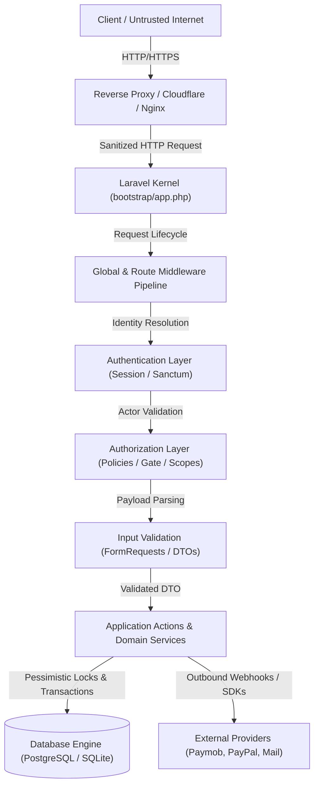

# Phase 5.5 — Security Boundary Map

> **Standard:** Mandated by `promit.md` Section 76 for GouNow Platform Pre-Production Hardening.
> **Scope:** Defines each trust boundary traversed by incoming HTTP requests from the public internet down to storage engines and external payment gateways.

---

## 1. Architectural Trust Flow Diagram

---

## 2. Boundary Inventory & Rigorous Security Analysis

### Boundary 1: Internet → Reverse Proxy
- **Trust Level:** Zero Trust (Public Internet, Arbitrary Actors, Bots, Attackers).
- **Input:** Raw TCP/TLS packets, Arbitrary HTTP headers, Query strings, Raw JSON/Multipart payloads.
- **Output:** Cleaned TLS connection, Terminated SSL, Injected `X-Forwarded-*` headers, Injected `CF-Connecting-IP`.
- **Validation:** TLS cipher suites, Request size limits (client_max_body_size), DDOS rate mitigation.
- **Authentication:** None.
- **Authorization:** None (Geo-blocking / WAF rules where applicable).
- **Logging:** Edge access logs (IP, Path, User-Agent, Response Code, TLS version).
- **Failure Behavior:** 400 Bad Request, 413 Payload Too Large, 502 Bad Gateway.

---

### Boundary 2: Reverse Proxy → Laravel Application Gateway
- **Trust Level:** Semi-Trusted (Local bridge between Nginx/Cloudflare and PHP-FPM).
- **Input:** Normalized FastCGI / HTTP request, Injected Proxy headers.
- **Output:** Raw Symfony / Laravel Request instance.
- **Validation:** `TrustProxies` validation (Ensuring `X-Forwarded-For` is only accepted from trusted upstream proxies).
- **Authentication:** None.
- **Authorization:** None.
- **Logging:** Application start metrics, Request start timestamp.
- **Failure Behavior:** 500 Internal Server Error if upstream FastCGI fails.

---

### Boundary 3: Laravel Application Gateway → Middleware Pipeline (S1 Standard)
- **Trust Level:** Controlled Boundary (Enforces pipeline sequencing).
- **Input:** `Illuminate\Http\Request`.
- **Output:** Filtered request with contextual attributes (`request_id`, normalized headers).
- **Validation:** `AssignRequestId`, `ForceJsonResponse`, `HandleCors`, `SetLocale`.
- **Authentication:** None (Pre-auth filters).
- **Authorization:** None.
- **Logging:** `SensitiveDataRedactionProcessor` attached to Logger; `X-Request-ID` attached to response.
- **Failure Behavior:** 
  - 405 Method Not Allowed on method spoofing mismatch.
  - Standard JSON Error Envelope `{ "error": { "code": "...", "message": "...", "request_id": ... } }`.

---

### Boundary 4: Middleware Pipeline → Authentication Layer
- **Trust Level:** Identity Establishment Boundary.
- **Input:** Bearer Token (`Authorization: Bearer ...`) OR Session Cookie (`laravel_session` + `X-XSRF-TOKEN`).
- **Output:** Authenticated `App\Models\User` model instance OR Guest State.
- **Validation:** Token cryptographic signature (Sanctum SHA-256 hash), Cookie decryptability, Session expiry check.
- **Authentication:**
  - `EnsureAccountActive`: Validates user account is `is_active == true` directly from fresh database state.
  - `EnsureTwoFactorVerified`: Enforces complete TOTP/2FA verification for privileged roles (`is_admin == true`).
- **Authorization:** Rejects unauthenticated requests to protected route groups.
- **Logging:** Authentication attempts, failed login attempts (with redacted password).
- **Failure Behavior:** 401 Unauthorized (Generic message, zero existence disclosure).

---

### Boundary 5: Authentication Layer → Authorization Layer (3-Layer Zero-Trust)
- **Trust Level:** Privileged Boundary.
- **Input:** Authenticated User, Target Entity/Action, Contextual Scope.
- **Output:** Boolean Authorization Decision (Allow / Deny).
- **Validation:** 
  - Model Policies (`App\Policies\*`).
  - Permission check (`resource.action`) via `PermissionResolver`.
  - Scope check (`own`, `assigned`, `all`).
  - State check (Entity status: e.g. booking cannot be cancelled if completed).
- **Authentication:** Active authenticated principal.
- **Authorization:** Strict 3-layer authorization.
- **Logging:** Authorization failures logged with `request_id`, `user_id`, `ability`, `resource_id`.
- **Failure Behavior:**
  - 404 Not Found on customer resource ownership mismatch (prevents IDOR existence leakage).
  - 403 Forbidden on authenticated administrative access denial.

---

### Boundary 6: Authorization Layer → Input Validation & FormRequests
- **Trust Level:** Controlled Parameter Boundary.
- **Input:** Raw JSON body, Route Model Bindings, Query Parameters.
- **Output:** Strictly Typed & Filtered `FormRequest::validated()` data array or DTO.
- **Validation:**
  - Whitelist validation rules (`min`, `max`, `in`, `prohibited`).
  - Prohibited mass assignment fields (`price`, `total`, `is_admin`, `role_ids`).
  - Nested array bounds, date formatting (`Y-m-d`), string length constraints.
- **Authentication:** Preserved.
- **Authorization:** `FormRequest::authorize()` mirrors or delegates to Model Policy.
- **Logging:** Validation error counts; field names failing validation.
- **Failure Behavior:** 422 Unprocessable Entity with normalized error details dictionary.

---

### Boundary 7: FormRequests → Application Actions & Domain Services
- **Trust Level:** Core Business Domain (Trusted Input Guarantee).
- **Input:** Strictly Validated DTO / Request parameters.
- **Output:** Mutated Domain Models, Calculated Financial Value Objects (`QuoteDTO`, `BookingStatus`).
- **Validation:** Business Invariant verification (State transitions via `BookingStateMachine`, Availability calculation via `CheckPropertyAvailabilityQuery`).
- **Authentication:** Actor identity explicitly injected into DTO or Action.
- **Authorization:** Business invariant assertions.
- **Logging:** Business events (e.g. `BookingStatusChangedEvent`), Audit trail logging.
- **Failure Behavior:** Domain Exceptions (`BookingUnavailableException`, `InvalidStateTransitionException`, `PaymentFailedException`).

---

### Boundary 8: Application Actions → Database Engine
- **Trust Level:** Highly Trusted Storage Boundary.
- **Input:** Parameterized SQL queries, Explicit Row Locks (`lockForUpdate()`), Database Transactions (`DB::transaction`).
- **Output:** Persisted database records, Auto-increment IDs, Timestamps.
- **Validation:**
  - Database schema types (Integer minor cents, Timestamps with timezone).
  - Foreign Key Constraints with explicit deletion policies (`restrict`, `cascade`).
  - PostgreSQL Exclusion Constraints (e.g. `EXCLUDE USING gist (bookable_id WITH =, daterange(check_in, check_out, '[)') WITH &&)`).
  - Unique indices (e.g. `idempotency_keys.key_hash`, `users.email`).
- **Authentication:** Database user credentials managed via environment (`.env`).
- **Authorization:** Scoped queries (`scopeVisibleTo`).
- **Logging:** Database query logs enabled strictly in debugging/characterization mode.
- **Failure Behavior:** Immediate Transaction Rollback; 500 error envelope without SQL query or SQLSTATE leakage.

---

### Boundary 9: Application Actions → External Providers (Payment & Messaging)
- **Trust Level:** External Semi-Trusted Gateway.
- **Input:** Structured HTTPS Payload (Merchant ID, API Secret, Currency, Integer Cents, Customer Token).
- **Output:** External Transaction ID, 3DS Redirection URL, Webhook Dispatch.
- **Validation:** Payload sanity check before dispatch, SSL certificate verification.
- **Authentication:** HMAC SHA-256 / Bearer API Keys stored in `.env`.
- **Authorization:** Outbound server-to-server call.
- **Logging:** Outbound call latency and status code; credentials redacted by `SensitiveDataRedactionProcessor`.
- **Failure Behavior:** Controlled catch block, Transaction rollback if critical, 502/402 error returned to client.

---

### Boundary 10: External Providers → Inbound Webhook Receiver
- **Trust Level:** Untrusted Inbound Callback.
- **Input:** Inbound HTTP POST payload, Signature header (`X-Webhook-Signature` / `X-Paymob-Signature`).
- **Output:** Atomic idempotent payment confirmation, State transition.
- **Validation:**
  - **Cryptographic HMAC verification over raw request body** (MUST BE PRODUCTION GRADE, NO PLACEHOLDERS).
  - Idempotency key / transaction reference uniqueness check.
- **Authentication:** Cryptographic Webhook Signature.
- **Authorization:** Verified provider authenticity.
- **Logging:** Webhook received event, transaction reference, redacted payload.
- **Failure Behavior:** 401 Unauthorized for invalid signatures, 200 OK with no-op for duplicate/replayed events.
