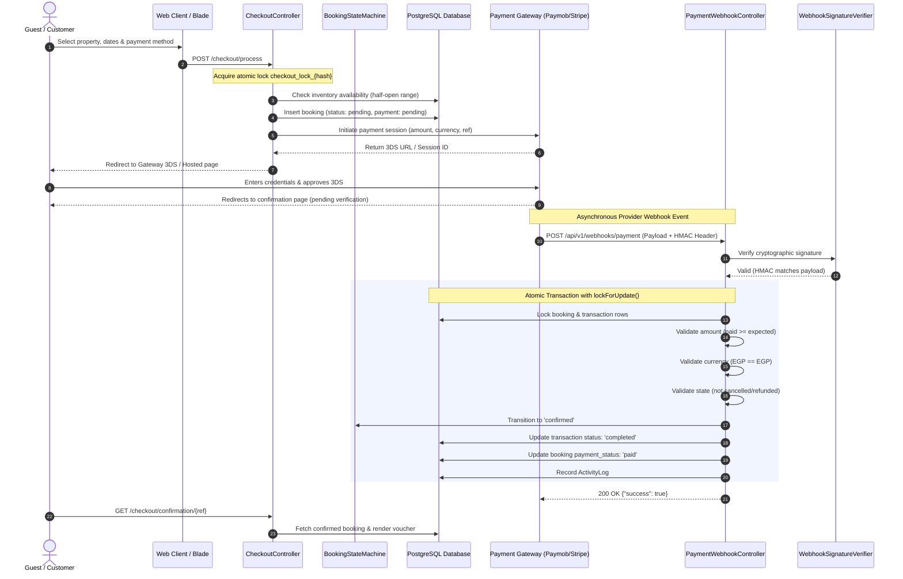

# PHASE 6 — PAYMENT ARCHITECTURE & INVENTORY

## 1. Executive Summary

This document provides a comprehensive inventory, architectural specification, and lifecycle trace of the payment and financial subsystems within the GouNow Lifestyle Platform (Laravel backend). It details every payment route, controller, middleware, service, gateway implementation, database entity, and financial trust boundary as hardened in Phase 6.

---

## 2. Complete Component Inventory

### 2.1 Route Inventory

| HTTP Method | URI | Route Name | Controller & Method | Middleware | Auth Required | CSRF Protected | Rate Limiter | Financial Mutation |
|---|---|---|---|---|---|---|---|---|
| `POST` | `/api/v1/bookings/calculate-quote` | `api.v1.bookings.calculate-quote` | `Api\V1\BookingController@calculateQuote` | `api`, `throttle:60,1` | No (Public) | No (Stateless API) | 60 req/min | None (Pure Calculation) |
| `POST` | `/api/v1/bookings` | `api.v1.bookings.store` | `Api\V1\BookingController@store` | `api`, `auth:sanctum`, `idempotency`, `throttle:30,1` | Yes (Bearer Token) | No (Stateless API) | 30 req/min | Creates Pending Booking & Financial Hold |
| `POST` | `/api/v1/webhooks/payment` | `api.v1.webhooks.payment` | `Api\V1\Webhooks\PaymentWebhookController@handle` | `api`, `webhook.signature`, `throttle:60,1` | Cryptographic HMAC | No (Signed Webhook) | 60 req/min | State Transition, Balance Settlement, Confirmation |
| `POST` | `/checkout/calculate` | `checkout.calculate` | `CheckoutController@calculate` | `web`, `throttle:checkout` | No (Public Guest) | Yes (`VerifyCsrfToken`) | `checkout` (10/min) | None (Pricing Calculation) |
| `GET` | `/checkout/{property:slug}` | `checkout.show` | `CheckoutController@show` | `web`, `throttle:checkout` | No (Public Guest) | N/A (GET) | `checkout` (10/min) | None |
| `POST` | `/checkout/process` | `checkout.process` | `CheckoutController@process` | `web`, `throttle:checkout` | No (Public Guest) | Yes (`VerifyCsrfToken`) | `checkout` (10/min) | Creates Pending Booking, Nightly Splits, Initiates Gateway Session |
| `GET` | `/checkout/confirmation/{reference}` | `checkout.confirmation` | `CheckoutController@confirmation` | `web`, `throttle:booking_confirmation` | IDOR Protected (Session / Token / Email / Auth) | N/A (GET) | 30 req/min | None (Read-only voucher) |
| `GET` | `/checkout/mock/card/{reference}` | `checkout.card-mock` | `CheckoutController@cardMock` | `web`, `throttle:checkout` | Sandbox Only (`local`/`testing`) | N/A (GET) | `checkout` (10/min) | None (Simulation Screen) |
| `POST` | `/checkout/mock/card/{reference}/complete` | `checkout.card-mock.complete` | `CheckoutController@cardMockComplete` | `web`, `throttle:checkout` | Sandbox Only (`local`/`testing`) | Yes (`VerifyCsrfToken`) | `checkout` (10/min) | Simulates Gateway Approval (Blocked in Prod) |
| `POST` | `/checkout/mock/card/{reference}/decline` | `checkout.card-mock.decline` | `CheckoutController@cardMockDecline` | `web`, `throttle:checkout` | Sandbox Only (`local`/`testing`) | Yes (`VerifyCsrfToken`) | `checkout` (10/min) | Simulates Gateway Decline (Blocked in Prod) |
| `GET` | `/checkout/mock/paypal/{reference}` | `checkout.paypal-mock` | `CheckoutController@paypalMock` | `web`, `throttle:checkout` | Sandbox Only (`local`/`testing`) | N/A (GET) | `checkout` (10/min) | None (Simulation Screen) |
| `POST` | `/checkout/mock/paypal/{reference}/complete` | `checkout.paypal-mock.complete` | `CheckoutController@paypalMockComplete` | `web`, `throttle:checkout` | Sandbox Only (`local`/`testing`) | Yes (`VerifyCsrfToken`) | `checkout` (10/min) | Simulates PayPal Capture (Blocked in Prod) |
| `POST` | `/admin/bookings/{booking}/refund` | `admin.bookings.refund` | `Admin\BookingController@refund` | `web`, `auth`, `can:bookings.refund`, `reauth` | Yes (Admin Role + Reauth) | Yes (`VerifyCsrfToken`) | 10 req/min | Executes Gateway Refund, Deducts Balance, Updates Audit Log |

---

### 2.2 Middleware Stack

1. **`VerifyWebhookSignature` (`app/Http/Middleware/VerifyWebhookSignature.php`)**:
   - Enforces HMAC cryptographic verification before webhook requests reach controllers.
   - Inspects headers: `x-paymob-signature`, `stripe-signature`, `x-webhook-signature`, `x-signature`.
   - Rejects missing, unparseable, or invalid signatures with `401 Unauthorized` standard error envelopes.
   - Prohibits signature bypass in production environments (`fail-closed` policy).
2. **`EnsureIdempotency` (`app/Http/Middleware/EnsureIdempotency.php`)**:
   - Isolates idempotency keys per actor (`actor_scope` partitioned by `user:{id}`, `session:{id}`, or `guest:{hash}`).
   - Employs database-backed atomic reservations (`idempotency_keys` table with composite unique constraint `[actor_scope, key]`).
   - Prevents concurrent race conditions via in-flight detection (`409 Conflict`).
   - Caches completed HTTP responses to guarantee deterministic re-delivery without re-executing mutations.
3. **`ThrottleRequests` (`throttle:checkout`, `throttle:booking_confirmation`)**:
   - Throttles brute force quote generation, rapid-fire booking attempts, and confirmation enumeration.

---

### 2.3 Services & Gateway Integrations

1. **`PaymentService` (`app/Services/Payment/PaymentService.php`)**:
   - Core domain orchestrator for initiating transactions, processing confirmations, managing partial/full refunds, and maintaining booking financial consistency.
   - Executes all status transitions inside database transactions (`DB::transaction()`) using pessimistic locking (`lockForUpdate()`).
   - Enforces business invariants: refunds cannot exceed captured funds, refunds require `completed` status, partial refunds accumulate safely.
2. **`WebhookSignatureVerifier` (`app/Services/Payment/WebhookSignatureVerifier.php`)**:
   - Cryptographic verification engine.
   - **Paymob SHA-512 Callback**: Concatenates canonical 20-field string (`amount_cents`, `created_at`, `currency`, `error_occured`, `has_parent_transaction`, `id`, `integration_id`, `is_3d_secure`, `is_auth`, `is_capture`, `is_refunded`, `is_standalone_payment`, `is_voided`, `order.id`, `owner`, `pending`, `source_data.pan`, `source_data.sub_type`, `source_data.type`, `success`) and computes `hash_hmac('sha512', ...)`.
   - **Stripe / Generic HMAC-SHA256**: Supports timestamped header formats (`t=...,v1=...`) with 300-second drift tolerance and raw payload hashing.
   - Utilizes timing-safe `hash_equals()` to prevent side-channel timing attacks.
3. **Payment Gateways (`app/Services/Payment/Gateways/`)**:
   - `CardGateway`: Manages credit/debit card session initiation, 3DS authentication redirection, and signed callback processing.
   - `PaymobGateway`: Paymob integration managing intention tokens, iframe URLs, and HMAC-verified callbacks.
   - `StripeGateway`: Stripe Checkout session creation, PaymentIntent handling, and webhook processing.
   - `PayPalGateway`: PayPal Order v2 API integration and capture handling.
   - `CashGateway`: Offline manual settlement workflow with strict operator approval requirements.

---

## 3. End-to-End Payment Flow Trace

---

## 4. Trust Boundaries & Security Enforcements

1. **Client Price Tampering Immunity**: The client never specifies prices or totals. All pricing is recalculated authoritatively on the server from property rate cards, seasonal rules, and guest parameters.
2. **Double Submission Defense**: Web checkout processes are locked via atomic cache keys (`checkout_lock_{hash}`) with 30-second TTL, preventing duplicate pending bookings during network lag or multi-clicking.
3. **Isolation of Mock Endpoints**: All mock gateway simulation routes (`/checkout/mock/*`) are conditionally registered and enforced via `abort_unless(app()->environment('local', 'testing'), 403)` at the controller layer, ensuring zero exposure in production environments.
4. **Idempotent Webhook Replay**: Duplicate delivery of payment webhook notifications is recognized via existing transaction status (`completed`), returning a 200 response (`replayed: true`) without performing duplicate financial modifications or state shifts.
