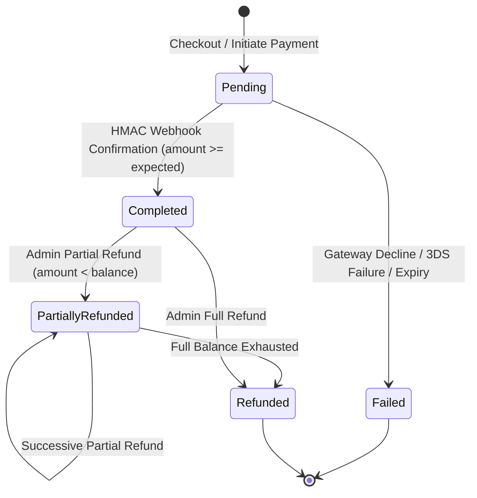

# PHASE 6 — PAYMENT & BOOKING STATE MACHINE SPECIFICATION

## 1. Executive Summary

This document defines the formal state machine governing financial transactions and their synchronized booking domain states within the GouNow Lifestyle Platform. It details allowed transitions, triggering actors, required provider evidence, database mutations, and refund implications.

---

## 2. Core Entities & States

The financial lifecycle consists of two tightly coupled state machines:
1. **Transaction Lifecycle** (`transactions.status`):
   - `pending`
   - `completed`
   - `failed`
   - `partially_refunded`
   - `refunded`
2. **Booking Domain Lifecycle** (`bookings.status` & `bookings.payment_status`):
   - **Lifecycle Status** (`status`): `draft`, `pending`, `confirmed`, `checked_in`, `completed`, `cancelled`
   - **Payment Status** (`payment_status`): `pending`, `partially_paid`, `paid`, `partially_refunded`, `refunded`, `failed`

---

## 3. Formal State Machine Specification

### 3.1 Transaction State Transitions

| State | Allowed Incoming | Allowed Outgoing | Triggering Actor | Required Provider Evidence | Database Mutation (`transactions`) | Booking Mutation (`bookings`) |
|---|---|---|---|---|---|---|
| **`pending`** | Initial Creation | `completed`, `failed` | Customer / Web Checkout / API | Valid session creation from Payment Gateway | `status = 'pending'`, `created_at = now()` | `status = 'pending'`, `payment_status = 'pending'` |
| **`completed`** | `pending` | `partially_refunded`, `refunded` | Payment Gateway (HMAC Webhook) | Cryptographically signed webhook (`hash_hmac`), matching `reference`, matching `currency`, `amount_cents >= total` | `status = 'completed'`, `gateway_reference = {id}`, `metadata = {sanitized_payload}` | `status = 'confirmed'`, `payment_status = 'paid'`, `paid_amount_cents = amount` |
| **`failed`** | `pending` | *Terminal* | Payment Gateway / Simulation | Signed decline callback or gateway failure notification | `status = 'failed'`, `failure_reason = {reason}` | `payment_status = 'failed'` (inventory hold released upon TTL expiration) |
| **`partially_refunded`** | `completed`, `partially_refunded` | `refunded` | Finance Admin (via `can:bookings.refund` + Reauth) | Successful gateway refund receipt (`refund_id`), `amount <= remaining_refundable` | `status = 'partially_refunded'`, `refunded_amount_cents += amount` | `payment_status = 'partially_refunded'`, `refund_amount_cents += amount` |
| **`refunded`** | `completed`, `partially_refunded` | *Terminal* | Finance Admin (via `can:bookings.refund` + Reauth) | Successful gateway full refund receipt, `refunded_amount_cents == total_amount_cents` | `status = 'refunded'`, `refunded_amount_cents = total` | `status = 'cancelled'`, `payment_status = 'refunded'`, `refund_amount_cents = total` |

---

## 4. State Diagram

---

## 5. Booking / Payment Consistency Invariants

1. **No Confirmation Without Payment Evidence**:
   A booking can NEVER transition to `status = 'confirmed'` without either:
   - A cryptographically verified payment webhook confirming full capture.
   - An authorized operator recording verified offline settlement (`cash` payment method with audit log).
2. **Strict Amount Verification (Undercut Defense)**:
   A payment confirmation webhook is rejected with `422 Unprocessable Entity` (`AMOUNT_MISMATCH`) if the reported paid amount (`amount_cents`) is less than the booking's authoritative total (`total_amount_cents`).
3. **Currency Alignment**:
   A payment confirmation webhook is rejected with `422 Unprocessable Entity` (`CURRENCY_MISMATCH`) if the transaction currency differs from the booking's locked currency.
4. **No Post-Cancellation Revivals**:
   A webhook attempting to confirm a booking that has already transitioned to `cancelled` or `refunded` is strictly rejected with `409 Conflict` (`INVALID_STATE_TRANSITION`). The payment is flagged for immediate financial investigation without reviving reservation inventory.
5. **Atomic Transaction Isolation**:
   All state updates modifying transactions and bookings execute within a PostgreSQL transaction wrapped in `DB::transaction()` utilizing pessimistic row locking (`lockForUpdate()`).
6. **Refund Bound Invariant**:
   At all times:
   $$\sum \text{Refunds} \le \text{Captured Amount} \le \text{Booking Total}$$
   Any refund operation violating this inequality throws an `InvalidArgumentException` and rolls back atomically.
