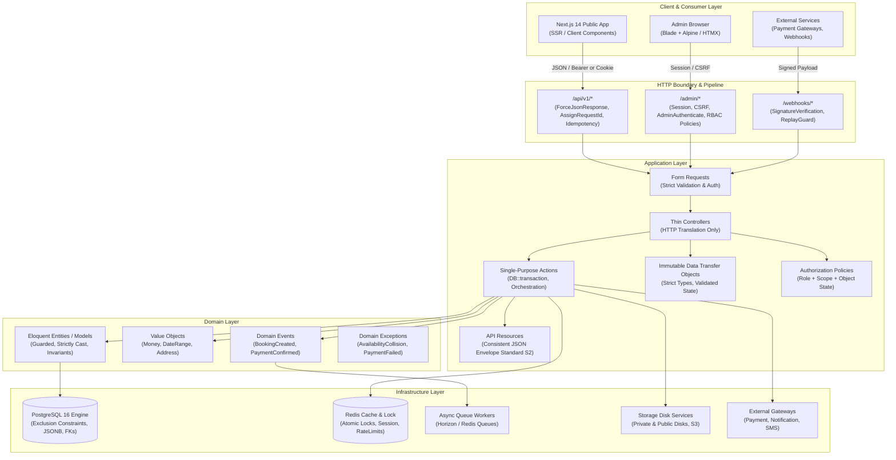

# GouNow Target Architecture Specification (P1-T15)

> **Document Status**: APPROVED for Implementation starting Phase 2  
> **Target Alignment**: Laravel 12 Enterprise Standard, Next.js 14 Integration, Zero-Trust RBAC

---

## 1. Architectural Philosophy & Boundaries

The target architecture establishes a clean, decoupled boundary between:
1. **The Laravel Core**: Serving as the authoritative Domain & Business Logic Engine, Transaction Guardian, and REST API provider (`/api/v1/*`), while retaining the Blade Admin Portal (`/admin/*`) as a resilient operational dashboard.
2. **The Next.js Frontend**: The public consumer and guest booking client, interacting exclusively with `/api/v1/*` via typed API clients, receiving consistent JSON envelopes.
3. **The Presentation Boundary**: Strict separation between API endpoints (JSON only, no session redirects, no Blade rendering) and Web endpoints (Session-based, Blade-rendered).



---

## 2. Directory Structure Conventions

To maintain backward compatibility and avoid destabilizing the active workspace, the target structure organizes domain logic cleanly under `app/Modules/` and standardizes the API pipeline under `app/Http/`.

```text
backend/
├── app/
│   ├── Http/
│   │   ├── Controllers/
│   │   │   ├── Api/
│   │   │   │   └── V1/
│   │   │   │       ├── Public/         <-- Stays, Experiences, Events, Quotes
│   │   │   │       ├── Customer/       <-- Bookings, Profile, Saved Items
│   │   │   │       ├── Admin/          <-- Headless Admin API endpoints
│   │   │   │       └── Webhooks/       <-- Payment and Partner callbacks
│   │   │   ├── Admin/                  <-- Existing Blade Admin Controllers (Refactored)
│   │   │   └── Auth/                   <-- Authentication Controllers
│   │   ├── Middleware/
│   │   │   ├── AssignRequestId.php     <-- Injects X-Request-ID (S1 Standard)
│   │   │   ├── ForceJsonResponse.php   <-- Enforces application/json on /api/*
│   │   │   ├── EnsureIdempotency.php   <-- Idempotency-Key caching & deduplication
│   │   │   ├── EnsureAccountActive.php <-- Account state verification
│   │   │   └── CheckPermission.php     <-- Granular RBAC permission gate
│   │   ├── Requests/
│   │   │   ├── Api/V1/...              <-- Dedicated API FormRequests
│   │   │   └── Admin/...               <-- Admin FormRequests (replacing inline validate)
│   │   └── Resources/
│   │       └── Api/V1/                 <-- Standard S2 JsonResources
│   ├── Modules/
│   │   ├── Booking/
│   │   │   ├── Domain/                 <-- Booking, BookingItem, Exceptions
│   │   │   ├── Application/
│   │   │   │   ├── Actions/            <-- CreateBookingAction, CancelBookingAction
│   │   │   │   ├── DTOs/               <-- BookingDTO, QuoteDTO
│   │   │   │   └── Policies/           <-- BookingPolicy
│   │   │   └── Infrastructure/         <-- PricingEngine, AvailabilityService
│   │   ├── Property/
│   │   │   ├── Domain/                 <-- Property, Unit, PricingRule
│   │   │   ├── Application/Actions/    <-- StorePropertyAction, UpdatePropertyAction
│   │   │   └── Application/Policies/   <-- PropertyPolicy
│   │   ├── Experience/
│   │   ├── Event/
│   │   └── Payment/
│   │       ├── Domain/                 <-- Payment, Refund, Transaction
│   │       ├── Application/Actions/    <-- ProcessPaymentAction, HandleWebhookAction
│   │       └── Infrastructure/         <-- CardGateway, PayPalGateway, PaymobGateway
│   ├── Enums/                          <-- Strict PHP 8.2+ Backed Enums
│   └── Support/
│       ├── Idempotency/
│       ├── Money/
│       └── Response/                   <-- Standardized ApiEnvelope Builder
├── routes/
│   ├── api.php                         <-- Fallback root
│   ├── api/
│   │   └── v1/
│   │       ├── public.php              <-- /api/v1/stays, /api/v1/experiences, etc.
│   │       ├── customer.php            <-- /api/v1/customer/* (auth:sanctum)
│   │       ├── admin.php               <-- /api/v1/admin/* (auth:sanctum + can:*)
│   │       └── webhooks.php            <-- /api/v1/webhooks/*
│   └── web.php                         <-- Web and Blade Admin routes
```

---

## 3. Layer Responsibilities & Contracts

| Layer | Component | Permitted Operations | Prohibited Operations |
|---|---|---|---|
| **Boundary** | Middleware | Header parsing, Request-ID injection, Rate limiting, CORS, JSON enforcement. | Business logic, direct database mutations. |
| **Boundary** | FormRequest | Schema validation, type casting, basic request-level authorization. | Complex domain logic, external API calls. |
| **Presentation** | Controller | Calling FormRequest, instantiating DTO, invoking Action, returning Resource. | Raw database queries, sending emails, calculating financial sums. |
| **Application** | Action | DB transactions, orchestrating domain models, dispatching events, logging audits. | HTTP headers access, rendering views, returning HTTP responses. |
| **Application** | DTO | Immutable validated state representation (`readonly class`). | Business logic, side effects, database persistence. |
| **Domain** | Model / Entity | Encapsulating entity invariants, relationships, model scopes, event emission. | Direct HTTP input parsing, authorization checks, external service calls. |
| **Domain** | Policy | Verifying user roles, permissions, scopes, and object state. | Modifying model state, returning HTTP responses. |
| **Presentation** | Resource | Transforming entity state into Standard S2 success envelope. | Database queries (must use `whenLoaded()`), mutating state. |

---

## 4. Response Contract Compliance (Standard S2)

All `/api/v1/*` responses strictly follow the standardized envelope:

### Success Response Envelope:
```json
{
  "data": {
    "id": "01J9...",
    "type": "bookings",
    "attributes": {
      "reference": "GN-2026-8941",
      "status": "confirmed",
      "total_amount_cents": 150000,
      "currency": "EGP",
      "check_in": "2026-11-01T14:00:00Z",
      "check_out": "2026-11-05T11:00:00Z"
    }
  },
  "meta": {
    "request_id": "c7a8b3d0-9f2e-4b1a-8c7e-123456789abc",
    "timestamp": "2026-10-02T22:30:00Z"
  }
}
```

### Error Response Envelope:
```json
{
  "error": {
    "code": "AVAILABILITY_COLLISION",
    "message": "The selected property is not available for the specified date range.",
    "details": {
      "dates": ["2026-11-02", "2026-11-03"]
    },
    "request_id": "c7a8b3d0-9f2e-4b1a-8c7e-123456789abc",
    "timestamp": "2026-10-02T22:30:00Z"
  }
}
```

---

## 5. Security & Isolation Matrix

1. **Deny-by-Default Authorization**: Every endpoint requires explicit authentication and capability checks (`can:resource.action`).
2. **Anti-Tampering / Idempotency**: All mutation endpoints (`POST /checkout/process`, `POST /checkout/payment/*`) require an `Idempotency-Key` UUID header, tracked in Redis/Cache with 24-hour TTL.
3. **Data Integrity & Money**: Money values are strictly represented in minor integer units (`cents` or `piastres`) across database, DTOs, and API responses. No float arithmetic is permitted in financial calculations.
4. **PostgreSQL Concurrency Safeguards**: Direct utilization of PostgreSQL `btree_gist` exclusion constraints for date ranges, preventing double bookings at the database engine level.
