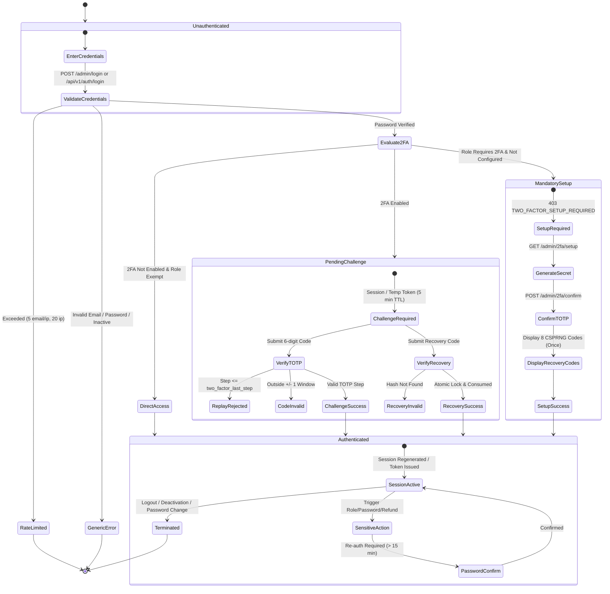
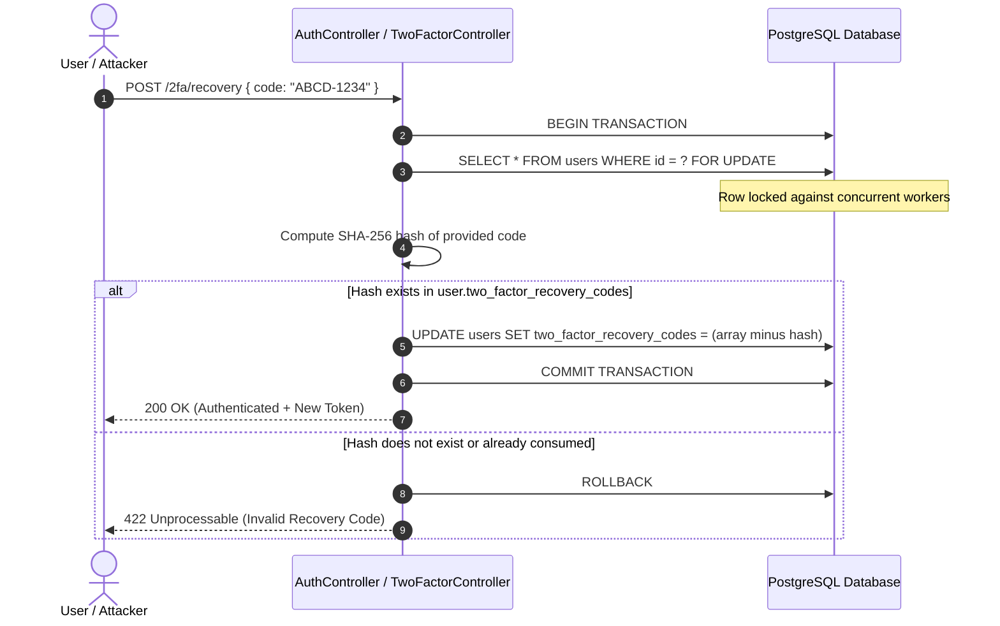

# Two-Factor Authentication (2FA) State Machine & Verification Flow

## 1. Overview
The GouNow platform implements an RFC 6238-compliant Time-Based One-Time Password (TOTP) engine with hardware-level security semantics, atomic single-use recovery codes, replay prevention, and strict administrative enforcement.

---

## 2. Authentication & 2FA State Machine



---

## 3. Web & API State Transitions

### 3.1 Web Administration Console (Session-Based)
1. **Initial Login**: User submits email + password at `/admin/login`.
2. **If 2FA Enabled**:
   - Session is invalidated and regenerated to purge pre-auth session state.
   - `auth.2fa.user_id`, `auth.2fa.expires_at` (5 minutes TTL), and `auth.2fa.remember` stored in isolated session variables.
   - User is redirected to `/admin/2fa/challenge`.
3. **Challenge Verification**:
   - User submits TOTP code.
   - `TotpService` validates code within $\pm 1$ step window (60s total tolerance).
   - If time step $\le$ `two_factor_last_step`, request is aborted with replay violation.
   - On success: `Auth::loginUsingId()`, session regenerated, `2fa_verified` flag set to `true`.
4. **Mandatory 2FA Enforcement**:
   - If an unconfigured user with role `super_admin`, `finance`, or `property_manager` accesses `/admin`, `EnsureTwoFactorVerified` intercepts and redirects them to `/admin/2fa/setup`.

### 3.2 Next.js SPA & REST API (Token-Based)
1. **Initial Login**: Client calls `POST /api/v1/auth/login`.
2. **If 2FA Enabled**:
   - Instead of a full-access token, the API issues an encrypted temporary token (`two_factor_token`) with a 5-minute lifespan:
     ```json
     {
       "data": {
         "requires_2fa": true,
         "two_factor_token": "eyJpdiI6...",
         "user": {
           "id": 1,
           "email": "admin@gounow.com"
         }
       },
       "meta": { "request_id": "...", "timestamp": "..." }
     }
     ```
3. **Challenge Verification**:
   - Client calls `POST /api/v1/auth/2fa/challenge` passing `{ "two_factor_token": "...", "code": "123456" }`.
   - On success: issues a full Personal Access Token with `'2fa:verified'` ability.
4. **Mandatory Setup Interception**:
   - Protected API routes return HTTP 403:
     ```json
     {
       "error": {
         "code": "TWO_FACTOR_SETUP_REQUIRED",
         "message": "Two-factor authentication setup is mandatory for your role.",
         "details": null,
         "request_id": "...",
         "timestamp": "..."
       }
     }
     ```

---

## 4. Recovery Code Lifecycle & Concurrency Defense



### Concurrency Invariant:
Because `User::consumeRecoveryCode()` executes within a pessimistic row lock (`lockForUpdate()`), race conditions attempting to use the same recovery code across simultaneous HTTP requests are serialized. Exactly **one** request succeeds; all concurrent attempts are safely rejected.

---

## 5. Security Invariants
1. **Zero Secret Leakage**: `two_factor_secret` is excluded from all JSON serializations (`$hidden` attribute) and encrypted at rest in the database.
2. **Replay Rejection**: Replaying a valid TOTP code within the same 30-second window is rejected by comparing the time-step against `two_factor_last_step`.
3. **One-Way Recovery Codes**: Recovery codes are never stored in plaintext. They are generated via CSPRNG, hashed with SHA-256 before persisting, and displayed to the user only once during setup or regeneration.
4. **Password-Gated Disabling**: Disabling 2FA requires passing the user's current password.
